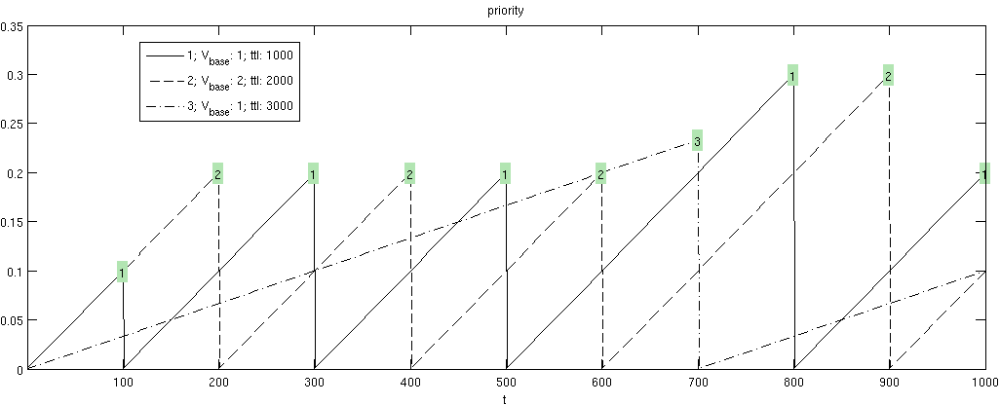

# goby-acomms: queue (Message Priority Queuing)

## Understanding dynamic priority queuing

Every message type is assigned its own sub-buffer (or queue). Several sub-buffers (or queues) are managed in aggregate by the DynamicBuffer or QueueManager class.

Each sub-buffer has a base value (\f$V_{base}\f$) and a time-to-live (\f$ttl\f$) that create the priority (\f$P(t)\f$) at any given time (\f$t\f$):

\f$P(t) = V_{base} \frac{(t-t_{last})}{ttl}\f$

 where \f$t_{last}\f$ is the time of the last send from this queue.

This means for every sub-buffer, the user has control over two variables (\f$V_{base}\f$ and \f$ttl\f$). \f$V_{base}\f$ is intended to capture how important the message type is in general. Higher base values mean the message is of higher importance. The \f$ttl\f$ governs the number of seconds the message lives from creation until it is destroyed by \c queue. The \f$ttl\f$ also factors into the priority calculation since all things being equal (same \f$V_{base}\f$), it is preferable to send more time sensitive messages first. So in these two parameters, the user can capture both overall value (i.e. \f$V_{base}\f$) and latency tolerance (\f$ttl\f$) of the message queue.

The following graph illustrates the priority growth over time of three sub-buffers with different \f$ttl\f$ and \f$V_{base}\f$. A message is sent every 100 seconds and the sub-buffer that is chosen is marked on the graph.


\image latex priority_graph.eps "Graph of the growth of queueing priorities for \c queue for three different queues. A message is sent every 100 seconds from the %queue with the highest priority (numbered on the graph)." width=0.9\textwidth

## goby::acomms::QueueManager or goby::acomms::DynamicBuffer

Goby Queue currently has two implementations: the original (goby::acomms::QueueManager) and a new implementation for Goby3 (goby::acomms::DynamicBuffer). The goal will be to eventually deprecate goby::acomms::QueueManager but since the goby::acomms::DynamicBuffer implementation is quite different, for now both are provided to ease transition.

The fundamental difference is that goby::acomms::QueueManager can only queue DCCL (Google Protocol Buffers) messages, whereas goby::acomms::DynamicBuffer is much more flexible and can queue any type than can provide its serialized size.

Other changes from QueueManager to DynamicBuffer include:

* `ack` is now called `ack_required` and defaults to false (formerly true)
* goby::acomms::DynamicSubBuffer (one or more of which make up the DynamicBuffer) can merge configuration options from two or more sources.
* `encode_on_demand` and `on_demand_skew_seconds` are not supported by DynamicBuffer


## goby::acomms::DynamicBuffer (new implementation in Goby3)

### Queuing Protobuf Options


This section gives an overview of the `queue` configuration options available. The full list is available in buffer.proto (as message goby::acomms::protobuf::DynamicBufferConfig).

Queue message options:

|name                |type    |default       |merge rule                       |description|
|--------------------|--------|--------------|---------------------------------|-----------|
|ack_required        |bool    |false         |true takes precedence over false | Whether an acoustic acknowledgment should be requested for messages sent from this queue.|
|blackout_time       |uint32  |0             |lowest value takes precedence    |Minimum number of seconds allowed between sending messages from this queue.|
|max_queue           |uint32  |0             |larger value takes precedence    |Allowed size of the queue before overflow. If newest_first is true, the oldest elements are removed upon overflow, else the newest elements are (the queue blocks). 0 is a special value signifying infinity (no maximum).|
|newest_first        |bool    |true          |true takes precedence over false |(true=FILO, false=FIFO) whether to send newest messages in the queue first (FILO) or not (FIFO).|
|ttl                 |int32   |1800          |use average of values            |the time in seconds a message lives after its creation before being discarded. This time-to-live also factors into the growth in priority of a queue. see value_base for the main discussion on this. 0 is a special value indicating infinite life (i.e. ttl = 0 is effectively the same as ttl = \f$\infty\f$)|
|value_base          |double  |1             |use average of values            |base priority value for this message queue. priorities are calculated on a request for data by the modem (to send a message). The queue with the highest priority (and isn't in blackout) is chosen. The actual priority (\f$P\f$) is calculated by \f$P(t) = V_{base} \frac{(t-t_{last})}{ttl}\f$ where \f$V_{base}\f$ is the value set here, \f$t\f$ is the current time (in seconds), \f$t_{last}\f$ is the time of the last send from this queue, and \f$ttl\f$ is the ttl option. Essentially, a message with low ttl will become effective quickly again after a sent message (the priority line grows faster). See above overview for further discussion.|

### Using DynamicBuffer

Using the DynamicBuffer is typically a matter of:

* Instantiating a DynamicBuffer (goby::acomms::DynamicBuffer::DynamicBuffer())
* Creating one or more sub-buffers with a unique string id and a destination modem id, as well as an instantiation of DynamicBufferConfig defining the queue parameters (goby::acomms::DynamicBuffer::create()).
* Pushing data to one or more sub-buffers (goby::acomms::DynamicBuffer::push()).
* Requesting the next item to be sent, based on destination and maximum size (goby::acomms::DynamicBuffer::top()). (This does not remove the value).
* Erasing a value once it has been acknowledged or is otherwise no longer needed. (goby::acomms::DynamicBuffer::erase()).
* Regularly calling DynamicBuffer::expire() to expire any messages that exceeded their TTL.
* As needed, replacing a sub-buffer with new configuration (goby::acomms::DynamicBuffer::replace()).

## goby::acomms::QueueManager (original legacy implementation)

### Queuing Protobuf Options


This section gives an overview of the `queue` configuration options available. The full list is available in queue.proto (as message goby::acomms::protobuf::QueuedMessageEntry).

Queue message options:

|name                |type    |default       |description|
|--------------------|--------|--------------|-----------|
|ack                 |bool    |true          |Same as DynamicBuffer's `ack_required`, except default value|
|blackout_time       |uint32  |0             |Same as DynamicBuffer|
|max_queue           |uint32  |0             |Same as DynamicBuffer|
|newest_first        |bool    |true          |Same as DynamicBuffer|
|ttl                 |int32   |1800          |Same as DynamicBuffer|
|value_base          |double  |1             |Same as DynamicBuffer|
|encode_on_demand    |bool    |false        |(Advanced) enable on-demand encoding where rather than queueing data, the data request is forwarded up to the application level via the signal goby::acomms::QueueManager::signal_data_on_demand|
|on_demand_skew_seconds|double|1            |(Advanced) if encode_on_demand == true, this sets the number of seconds before data encoded on demand are considering stale and thus must be demanded again with the signal goby::acomms::QueueManager::signal_data_on_demand. Setting this to 0 is unadvisable as it will cause many calls to goby::acomms::QueueManager::signal_data_on_demand and thus waste CPU cycles needlessly encoding.|

`Queue`s Role options: Queue needs to know how to address a message (the source ID and destination ID) as well as the time the message was generated. This information either read from the fields of the of the DCCL message (setting: FIELD_VALUE) or is statically configured (setting: STATIC). In the latter case, the configuration value "static_value" is set and used for every DCCL message of this type that gets queued by this QueueManager. 

In the former case (the default), you can tag a given field of a DCCL message to a particular "role." This takes the place of a fixed transport layer header that protocols such as UDP use. The fields used in a given role can be anywhere within the message. The field is identified by its name (in the configuration value "field"). Submessage fields can be used by separating the field names by periods (".") until the child is a primitive type (e.g. uint32).

|RoleType|allowed field types|description|
|--- |--- |--- |
|SOURCE_ID|All integer types (uint32, int32, uint64, int64, ...)|The value in this field is used to represent the sending address (similar to an IP address) of the message.|
|DESTINATION_ID|All integer types (uint32, int32, uint64, int64, ...)|The value in this field is used to represent the destination address (similar to an IP address) of the message. 0 is reserved to indicate broadcast.|
|TIMESTAMP|uint64 or double|The value in this field is used as the timestamp of the message. If the type is double, it must be seconds (and fractional seconds) since the UNIX epoch (1970-01-01 midnight UTC). If it is a uint64, it must be microseconds since the UNIX epoch. This field used for expiring messages that exceed their ttl and thus must, in general, be set and correct.|


### Interacting with the QueueManager

#### Instantiate and configure

The goby::acomms::QueueManager is configured similarly to the goby::acomms::DCCLCodec. You need to set a unique identification number for this platform (the "modem ID") through the \link queue.proto goby::acomms::protobuf::QueueManagerConfig \endlink.

You can configure queues by added repeated fields to the QueueManagerConfig's message_entry field, or by calling goby::acomms::QueueManager::add_queue() directly.

When using goby::acomms::QueueManager you will not likely need to use the goby::acomms::DCCLCodec directly much at all. All messages are pushed to the queues unencoded and are encoded automatically by goby::acomms::QueueManager before sending. Likewise, all messages received are decoded before being provided on the signal goby::acomms::QueueManager::signal_receive.


For example, this code configures the QueueManager with a single queue (DCCL type GobyMessage)

```
goby::acomms::protobuf::QueueManagerConfig cfg;
cfg.set_modem_id(our_id);
goby::acomms::protobuf::QueuedMessageEntry* q_entry = cfg.add_message_entry();
q_entry->set_protobuf_name("GobyMessage");
q_entry->set_newest_first(true);

goby::acomms::protobuf::QueuedMessageEntry::Role* dest_role = q_entry->add_role();
dest_role->set_type(goby::acomms::protobuf::QueuedMessageEntry::DESTINATION_ID);
dest_role->set_field("header.dest_platform");    

goby::acomms::protobuf::QueuedMessageEntry::Role* time_role = q_entry->add_role();
time_role->set_type(goby::acomms::protobuf::QueuedMessageEntry::TIMESTAMP);
time_role->set_field("header.time");    

goby::acomms::protobuf::QueuedMessageEntry::Role* src_role = q_entry->add_role();
src_role->set_type(goby::acomms::protobuf::QueuedMessageEntry::SOURCE_ID);
src_role->set_field("header.source_platform");
q_manager.set_cfg(cfg);
```

#### Signals and (application layer) slots

Then, you need to do a few more initialization chores:

* Connect (using goby::acomms::connect()) QueueManager signals to your application layer slots (functions or member functions that match the signal's signature). You do not need to connect a slot to a given signal if you do not need its functionality. See \ref signal_slot for more on using signals and slots:
    * Received (and decoded) DCCL data: goby::acomms::QueueManager::signal_receive
    * Received acknowledgements: goby::acomms::QueueManager::signal_ack
    * Expired messages (ttl exceeded): goby::acomms::QueueManager::signal_expire
* Additional advanced features
    * Connect a slot to learn every time a queue size changes due to a new message being pushed or a message being sent: goby::acomms::QueueManager::signal_queue_size_change
    * Request that a queue be <i>on_demand</i>, that is, request data from the application layer every time the %modem layer requests data (DCCL messages only). This effectively bypasses the queue and forwards the modem's data request to the application layer. Use this for sending highly time sensitive data which needs to be encoded immediately prior to sending. Set the encode_on_demand option to true for that particular Protobuf message (and if desired change the on_demand_skew_seconds). You must also connect a slot that will be executed each time data is requested to the signal goby::acomms::QueueManager::signal_data_on_demand.

#### Operation

At this point the goby::acomms::QueueManager is ready to use. At the application layer, new messages are pushed to the queues for sending using goby::acomms::QueueManager::push_message. Each queue is identified by its DCCL (Protobuf) name.

At the driver layer, messages are requested using goby::acomms::QueueManager::handle_modem_data_request and incoming messages (including acknowledgments) are published using goby::acomms::QueueManager::handle_modem_receive. If using the goby-acomms drivers (i.e. some class derived from goby::acomms::ModemDriverBase), simply call goby::acomms::bind (ModemDriverBase&, QueueManager&) and these methods (slots) will be invoked automatically from the proper driver signals.

You must run goby::acomms::QueueManager::do_work() regularly (faster than 1 Hz; 10 Hertz is good) to process expired messages (goby::acomms::QueueManager::signal_expire). All other signals are emitted in response to a driver level signal (and thus are called during a call to goby::acomms::ModemDriverBase::do_work() if using the Goby modemdriver).

See queue_simple.cpp for a basic complete example.
