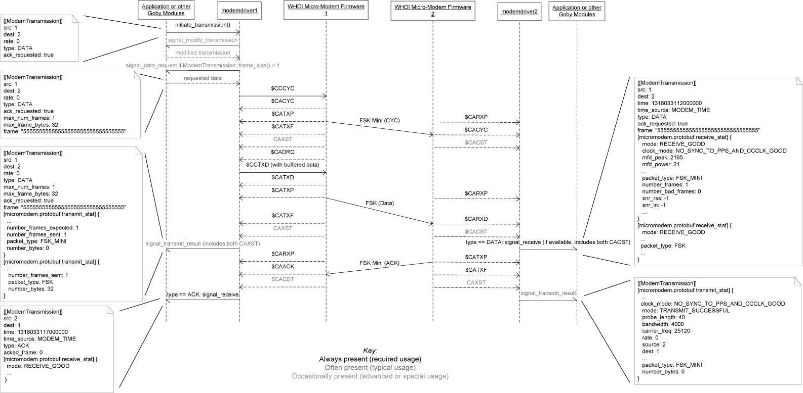
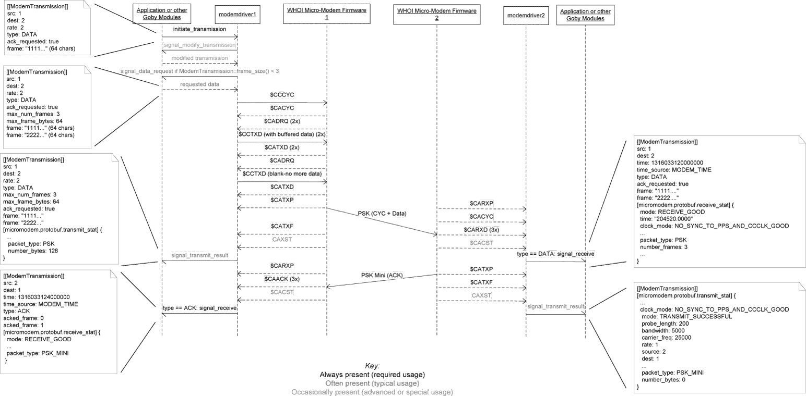
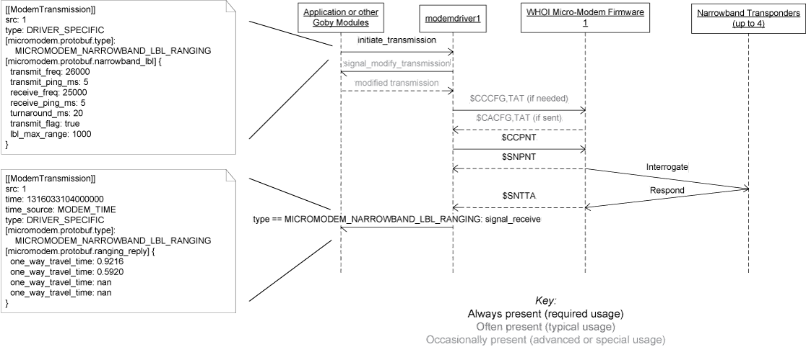
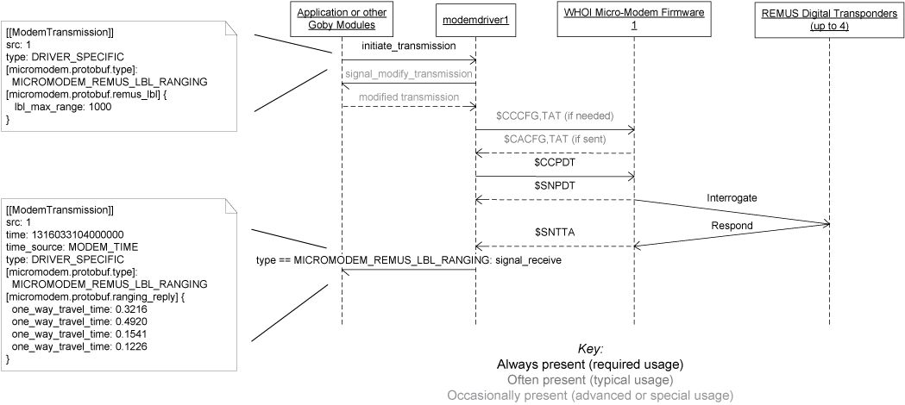
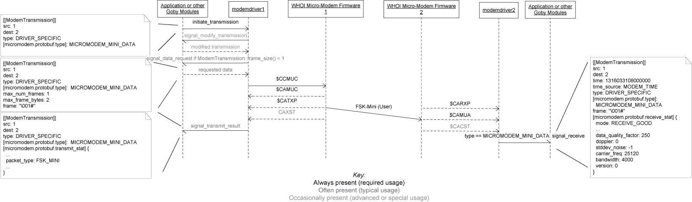
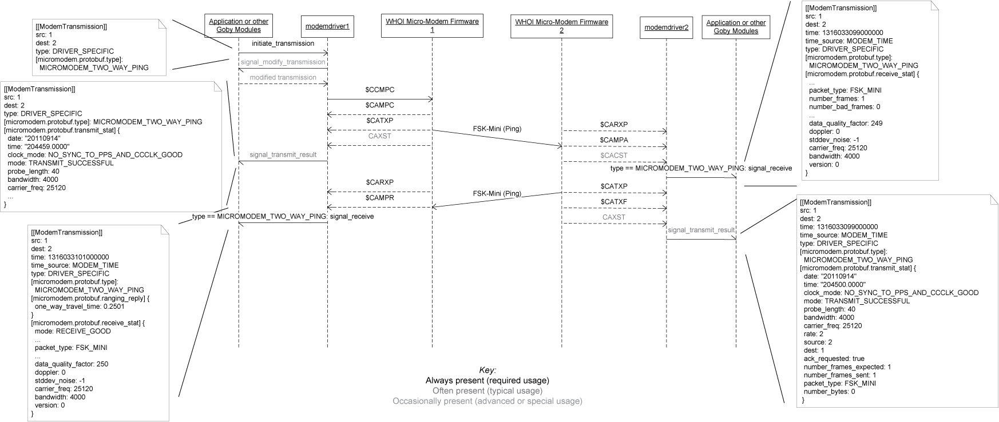
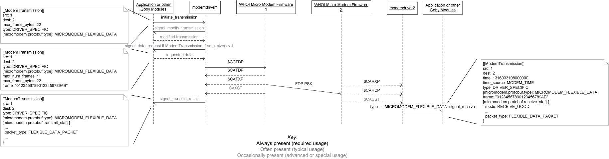

# goby-acomms: modemdriver (Driver to interact with modem firmware)

## Abstract class: ModemDriverBase

goby::acomms::ModemDriverBase defines the core functionality for an acoustic modem. It provides

* **A serial or serial-like (over TCP) reader/writer**. This is an instantiation of an appropriate derivative of the goby::util::LineBasedInterface class which reads the physical interface (serial or TCP) to the acoustic modem. The data (assumed to be ASCII lines offset by a delimiter such as NMEA0183 or the Hayes command set [AT]) are read into a buffer for use by the goby::acomms::ModemDriverBase derived class (e.g. goby::acomms::MMDriver). The type of interface is configured using a goby::acomms::protobuf::DriverConfig. The modem is accessed by the derived class using goby::acomms::ModemDriverBase::modem_start, goby::acomms::ModemDriverBase::modem_read, goby::acomms::ModemDriverBase::modem_write, and goby::acomms::ModemDriverBase::modem_close.
* **Signals** to be called at the appropriate time by the derived class. At the application layer, either bind the modem driver to a goby::acomms::QueueManager (goby::acomms::bind(goby::acomms::ModemDriverBase&, goby::acomms::QueueManager&) or connect custom function pointers or objects to the driver layer signals. 
* **Virtual functions**  for starting the driver (goby::acomms::ModemDriverBase::startup), running the driver (goby::acomms::ModemDriverBase::do_work), and initiating the transmission of a message (goby::acomms::ModemDriverBase::handle_initiate_transmission). The handle_initiate_transmission slot is typically bound to goby::acomms::MACManager::signal_initiate_transmission.

### Interacting with the goby::acomms::ModemDriverBase

To use the goby::acomms::ModemDriverBase, you need to create one of its implementations such as goby::acomms::MMDriver (WHOI Micro-Modem).

```
goby::acomms::ModemDriverBase* driver = new goby::acomms::MMDriver;
```

You will also need to configure the driver. At the very least this involves a serial port, baud, and modem ID (integer MAC address for the modem).

```
goby::acomms::protobuf::DriverConfig cfg;

cfg.set_serial_port("/dev/ttyS0");
cfg.set_modem_id(3);
```

Most modems will have specific other configuration that is required. For example the WHOI Micro-Modem NVRAM is set using three character strings followed by a number. This modem-specific configuration is stored as Protobuf extensions to goby::acomms::protobuf::DriverConfig, such as goby::acomms::micromodem::protobuf::config. If we were using the WHOI Micro-Modem and wanted to add an NVRAM configuration value we could write

```
cfg.MutableExtension(goby::acomms::micromodem::protobuf::config).add_nvram_cfg("DQF,1");
```

We need to connect any signals we are interested in. At a minimum this is goby::acomms::ModemDriverBase::signal_receive:

```
goby::acomms::connect(&driver->signal_receive, &handle_data_receive);
```

where handle_data_receive has the signature:
```
void handle_data_receive(const goby::acomms::protobuf::ModemTransmission& data_msg);
```

Next, we start up the driver with our configuration:

```
driver->startup(cfg);
```

We need to call goby::acomms::ModemDriverBase::do_work() on some reasonable frequency (greater than 5 Hz; 10 Hz is probably good). Whenever we need to transmit something, we can either directly call goby::acomms::ModemDriverBase::handle_initiate_transmission or connect goby::acomms::MACManager to do so for us on some TDMA cycle.

## Protobuf Message goby::acomms::protobuf::ModemTransmission

The goby::acomms::protobuf::ModemTransmission message is used for all outgoing (sending) and incoming (receiving) messages. The message itself only contains the subset of modem functionality that every modem is expected to support (point-to-point transmission of datagrams).

All other functionality is provided by [extensions](https://developers.google.com/protocol-buffers/docs/proto) to ModemTransmission such as those in mm_driver.proto for the WHOI Micro-Modem. These extensions provide access to additional features of the WHOI Micro-Modem (such as LBL ranging, two-way pings, and comprehensive receive statistics).

By making use of the Protobuf extensions in this way, Goby can both support unique features of a given modem while at that same time remaining general and agnostic to which modem is used when the features are shared (primarily data transfer).

## Writing a new driver

All of goby-acomms is designed to be agnostic of which physical modem is used. Different modems can be supported by subclassing goby::acomms::ModemDriverBase. You should check that a driver for your modem does not yet exist before attempting to create your own.

These are the requirements of the acoustic modem:

* it communicates using a line based text duplex connection using either serial or TCP (either client or server). NMEA0183 and AT (Hayes) protocols fulfill this requirement, for example. You can also write a driver that uses a different communication transport by implementing it directly in the driver rather than using the functionality in goby::acomms::DriverBase.
* it is capable of sending and verifying the accuracy (using a cyclic redundancy check or similar error checking) of fixed size datagrams (note that modems capable of variable sized datagrams also fit into this category).

Optionally, it can also support

* Acoustic acknowledgment of proper message receipt.
* Ranging to another acoustic modem or LBL beacons using time of flight measurements
* User selectable bit rates

The steps to writing a new driver include:

* Fully understand the basic usage of the new acoustic modem manually using minicom or other terminal emulator. Have a copy of the modem software interface manual handy.
* Figure out what type of configuration the modem will need. For example, the WHOI Micro-Modem is configured using string values (e.g. "SNV,1"). Extend goby::acomms::protobuf::DriverConfig to accomodate these configuration options. You will need to claim a group of extension field numbers that do not overlap with any of the drivers. The WHOI Micro-Modem driver goby::acomms::MMDriver uses extension field numbers 1000-1100 (see mm_driver.proto). You can read more about extensions in the official Google Protobuf documentation here: <https://developers.google.com/protocol-buffers/docs/proto>.
For example, if I was writing a new driver for the ABC Modem that needs to be configured using a few boolean flags, I might create a new message abc_driver.proto, make a note in driver_base.proto claiming extension number 1201.

* Subclass goby::acomms::ModemDriverBase and overload the pure virtual methods. Your interface should look like this (from `src/acomms/modemdriver/abc_driver.h`):

```cpp
namespace goby
{
namespace acomms
{
class ABCDriver : public ModemDriverBase
{
  public:
    ABCDriver();
    void startup(const protobuf::DriverConfig& cfg) override;
    void shutdown() override;
    void do_work() override;
    void handle_initiate_transmission(const protobuf::ModemTransmission& m) override;

  private:
    protobuf::DriverConfig driver_cfg_; // configuration given to you at launch
};
} // namespace acomms
} // namespace goby
```

* Fill in the methods. You are responsible for emitting the goby::acomms::ModemDriverBase signals at the appropriate times. Read on and all should be clear.

```
goby::acomms::ABCDriver::ABCDriver()
{
  // other initialization you can do before you have your goby::acomms::DriverConfig configuration object
}
```

* At startup() you get your configuration from the application (e.g. pAcommsHandler)

```cpp
void goby::acomms::ABCDriver::startup(const protobuf::DriverConfig& cfg)
{
    driver_cfg_ = cfg;
    // check `driver_cfg_` to your satisfaction and then start the modem physical interface
    if (!driver_cfg_.has_serial_baud())
        driver_cfg_.set_serial_baud(DEFAULT_BAUD);
    ModemDriverBase::modem_start(driver_cfg_);
    // ... send configuration to modem
} // startup
```

* At shutdown() you should make yourself ready to startup() again if necessary and stop the modem:

```cpp
void goby::acomms::ABCDriver::shutdown()
{
    // put the modem in a low power state?
    // ...
    ModemDriverBase::modem_close();
} // shutdown
```

* handle_initiate_transmission() is called when you are expected to initiate a transmission. It *may* contain data (in the ModemTransmission::frame field). If not, you are required to request data using the goby::acomms::ModemDriverBase::signal_data_request signal. Once you have data, you are responsible for sending it. I think a bit of code will make this clearer:

```cpp
void goby::acomms::ABCDriver::handle_initiate_transmission(
    const protobuf::ModemTransmission& orig_msg)
{
    protobuf::ModemTransmission msg = orig_msg;
    msg.set_max_frame_bytes(500);
    if (msg.frame_size() == 0)
        ModemDriverBase::signal_data_request(&msg);
    // ... encode and transmit msg
} // handle_initiate_transmission
```

* Finally, you can use do_work() to do continuous work. You can count on it being called at 5 Hz or more (in pAcommsHandler, it is called on the MOOS AppTick). Here's where you want to read the modem incoming stream.

```cpp
void goby::acomms::ABCDriver::do_work()
{
    std::string in;
    while (modem_read(&in))
    {
        // parse `in` and call ModemDriverBase::signal_receive(msg) or signal_raw_incoming(raw)
    }
} // do_work
```

The full ABC Modem example driver exists in acomms/modemdriver/abc_driver.h and acomms/modemdriver/abc_driver.cpp. A simulator for the ABC Modem exists that uses TCP to mimic a very basic set of modem commands (send data and acknowledgment). To use the ABC Modem using the goby3_example_driver_simple example, run this set of commands (`socat` is available in most package managers or at <http://www.dest-unreach.org/socat/>):

```
1. run goby_abc_modem_simulator running on same port (as TCP server)
> goby_abc_modem_simulator 54321
2. create fake tty terminals connected to TCP as client to port 54321
> socat -d -d -v pty,raw,echo=0,link=/tmp/ttyFAKE1 TCP:localhost:54321
> socat -d -d -v pty,raw,echo=0,link=/tmp/ttyFAKE2 TCP:localhost:54321
3. start up goby3_example_driver_simple
> goby3_example_driver_simple /tmp/ttyFAKE1 1 ABCDriver
// wait a few seconds to avoid collisions
> goby3_example_driver_simple /tmp/ttyFAKE2 2 ABCDriver
```

Notes:
* See goby::acomms::MMDriver for an example real implementation.
* When a message is sent to goby::acomms::BROADCAST_ID (0), it should be broadcast if the modem supports such functionality. Otherwise, the driver should throw an goby::acomms::ModemDriverException indicating that it does not support broadcast allowing the user to reconfigure their MAC / addressing scheme.

## WHOI Micro-Modem Driver: MMDriver

### Supported Functionality 

The goby::acomms::MMDriver extends the goby::acomms::ModemDriverBase for the WHOI Micro-Modem acoustic modem. It is tested to work with revision 0.94.0.00 of the Micro-Modem 1 and revision 2.0.16421 of the Micro-Modem 2 firmware, but is known to work with older firmware (at least 0.92.0.85). It is likely to work properly with newer firmware, and any problems while using newer Micro-Modem firmware should be filed as a [bug in Goby](https://github.com/GobySoft/goby3/issues). The following features of the WHOI Micro-Modem are implemented, which comprise the majority of the Micro-Modem functionality:


* FSK (rate 0) data transmission
* PSK (rates 1,2,3,4,5) data transmission
* Narrowband transponder LBL ping
* REMUS transponder LBL ping
* User mini-packet 13 bit data transmission
* Two way ping
* Flexible Data Protocol (Micro-Modem 2 only)
* Transmit FM sweep
* Transmit M-sequence


### Micro-Modem NMEA to Goby ModemTransmission mapping

Mapping between modem_message.proto and mm_driver.proto messages and NMEA fields (see the MicroModem users guide at https://acomms.whoi.edu/micro-modem/software-interface/ for NMEA fields of the WHOI Micro-Modem):

Modem to Control Computer ($CA / $SN):

| NMEA talker | Mapping |
|-------------|---------|
| $CACYC | If we did not send $CCCYC, buffer data for $CADRQ by augmenting the provided ModemTransmission and calling signal_data_request:<br>`ModemTransmission.time()` = `goby_time<uint64>()`<br>`ModemTransmission.src()` = ADR1<br>`ModemTransmission.dest()` = ADR2<br>`ModemTransmission.rate()` = Packet Type<br>`ModemTransmission.max_frame_bytes()` = 32 for Packet Type == 0, 64 for Packet Type == 2, 256 for Packet Type == 3 or 5<br>`ModemTransmission.max_num_frames()` = 1 for Packet Type == 0, 3 for Packet Type == 2, 2 for Packet Type == 3 or 8 for Packet Type == 5 |
| $CARXD | Only for the first $CARXD for a given packet (should match with the rest though):<br>`ModemTransmission.time()` = `goby_time<uint64>()`<br>`ModemTransmission.type()` = `ModemTransmission::DATA`<br>`ModemTransmission.src()` = SRC<br>`ModemTransmission.dest()` = DEST<br>`ModemTransmission.ack_requested()` = ACK<br>For each $CARXD:<br>`ModemTransmission.frame(F#-1)` = `hex_decode(HH...HH)` |
| $CAMSG | Used only to detect BAD_CRC frames ($CAMSG,BAD_CRC...). In extension `micromodem::protobuf::Transmission::frame_with_bad_crc`:<br>`frame_with_bad_crc(n)` = Frame with BAD CRC (assumed next frame after last good frame). n is an integer 0,1,2,... indicating the nth reported BAD_CRC frame for this packet (not the frame number). |
| $CAACK | `ModemTransmission.time()` = `goby_time<uint64>()`<br>`ModemTransmission.src()` = SRC<br>`ModemTransmission.dest()` = DEST<br>(first CAACK) `ModemTransmission.acked_frame(0)` = Frame#-1 (Goby starts at frame 0, WHOI starts at frame 1)<br>(second CAACK) `ModemTransmission.acked_frame(1)` = Frame#-1<br>(third CAACK) `ModemTransmission.acked_frame(2)` = Frame#-1<br>... |
| $CAMUA | `ModemTransmission.type()` = `ModemTransmission::DRIVER_SPECIFIC`<br>extension `micromodem::protobuf::Transmission::type` = `MICROMODEM_MINI_DATA`<br>`ModemTransmission.time()` = `goby_time<uint64>()`<br>`ModemTransmission.src()` = SRC<br>`ModemTransmission.dest()` = DEST<br>`ModemTransmission.frame(0)` = `hex_decode(HHHH)` |
| $CAMPR | `ModemTransmission.time()` = `goby_time<uint64>()`<br>`ModemTransmission.dest()` = SRC (SRC and DEST flipped to be SRC and DEST of $CCMPC)<br>`ModemTransmission.src()` = DEST<br>`ModemTransmission.type()` = `ModemTransmission::DRIVER_SPECIFIC`<br>extension `micromodem::protobuf::Transmission::type` = `MICROMODEM_TWO_WAY_PING`<br>In extension `micromodem::Transmission::protobuf::ranging_reply`:<br>`RangingReply::one_way_travel_time(0)` = Travel Time |
| $CAMPA | `ModemTransmission.time()` = `goby_time<uint64>()`<br>`ModemTransmission.src()` = SRC<br>`ModemTransmission.dest()` = DEST<br>`ModemTransmission.type()` = `ModemTransmission::DRIVER_SPECIFIC`<br>extension `micromodem::protobuf::Transmission::type` = `MICROMODEM_TWO_WAY_PING` |
| $SNTTA | `ModemTransmission.time()` = hhmmsss.ss (converted to microseconds since 1970-01-01 00:00:00 UTC)<br>`ModemTransmission.time_source()` = `MODEM_TIME`<br>`ModemTransmission.type()` = `ModemTransmission::DRIVER_SPECIFIC`<br>extension `micromodem::protobuf::Transmission::type` = `MICROMODEM_REMUS_LBL_RANGING` or `MICROMODEM_NARROWBAND_LBL_RANGING` (depending on which LBL type was last initiated)<br>`ModemTransmission.src()` = modem ID<br>In extension `micromodem::protobuf::Transmission::ranging_reply`:<br>`RangingReply.one_way_travel_time(0)` = TA<br>`RangingReply.one_way_travel_time(1)` = TB<br>`RangingReply.one_way_travel_time(2)` = TC<br>`RangingReply.one_way_travel_time(3)` = TD |
| $CAXST | Maps onto extension `micromodem::protobuf::Transmission::transmit_stat` of type `micromodem::protobuf::TransmitStatistics`. The two $CAXST messages (CYC and data) for a rate 0 FH-FSK transmission are grouped and reported at once. |
| $CACST | Maps onto extension `micromodem::protobuf::Transmission::receive_stat` of type `micromodem::protobuf::ReceiveStatistics`. The two $CACST messages for a rate 0 FH-FSK transmission are grouped and reported at once. Note that this message contains the one way time of flight for synchronous ranging (used instead of $CATOA).<br>Also sets (which will *overwrite* goby_time() set previously):<br>`ModemTransmission.time()` = TOA time (converted to microseconds since 1970-01-01 00:00:00 UTC)<br>`ModemTransmission.time_source()` = `MODEM_TIME` |
| $CAREV | Not translated into any of the modem_message.proto messages. Monitored to detect excessive clock skew (between Micro-Modem clock and system clock) or reboot (INIT). |
| $CAERR | Not translated into any of the modem_message.proto messages. Reported to goby::glog. |
| $CACFG | NVRAM setting stored internally. |
| $CACLK | Checked against system clock and if skew is unacceptable another $CCCLK will be sent. |
| $CADRQ | Data request is anticipated from the $CCCYC or $CACYC and buffered. Thus it is not translated into any of the Protobuf messages. |
| $CARDP | `ModemTransmission.type()` = `ModemTransmission::DRIVER_SPECIFIC`<br>extension `micromodem::protobuf::Transmission::type` = `MICROMODEM_FLEXIBLE_DATA`<br>`ModemTransmission.src()` = src<br>`ModemTransmission.dest()` = dest<br>`ModemTransmission.rate()` = rate<br>`ModemTransmission::frame(0)` = `hex_decode(df1+df2+df3...dfN)` where "+" means concatenate, unless any frame fails the CRC check, in which case this field is set to the empty string.<br>`micromodem::protobuf::frame_with_bad_crc(0)` = 0 indicates that Goby frame 0 is bad, if any sub-frame in the FDP has a bad CRC. |

Control Computer to Modem ($CC):

| NMEA talker | Mapping |
|-------------|---------|
| $CCTXD | SRC = `ModemTransmission.src()`<br>DEST = `ModemTransmission.dest()`<br>A = `ModemTransmission.ack_requested()`<br>HH...HH = `hex_encode(ModemTransmission::frame(n))`, where n is an integer 0,1,2,... corresponding to the Goby frame that this $CCTXD belongs to. |
| $CCCYC | Augment the ModemTransmission:<br>`ModemTransmission.max_frame_bytes()` = 32 for Packet Type == 0, 64 for Packet Type == 2, 256 for Packet Type == 3 or 5<br>`ModemTransmission.max_num_frames()` = 1 for Packet Type == 0, 3 for Packet Type == 2, 2 for Packet Type == 3 or 8 for Packet Type == 5<br>If ADR1 == modem ID and frame_size() < max_frame_size(), buffer data for later $CADRQ by passing the ModemTransmission to signal_data_request<br>CMD = 0 (deprecated field)<br>ADR1 = `ModemTransmission.src()`<br>ADR2 = `ModemTransmission.dest()`<br>Packet Type = `ModemTransmission.rate()`<br>ACK = if ADR1 == modem ID then `ModemTransmission.ack_requested()` else 1<br>Nframes = `ModemTransmission.max_num_frames()` |
| $CCCLK | Not translated from any of the modem_message.proto messages. (taken from the system time) |
| $CCCFG | Not translated from any of the modem_message.proto messages. (taken from values passed to the extension `micromodem::protobuf::Config::nvram_cfg` of `goby::acomms::protobuf::DriverConfig`). If the extension `micromodem::protobuf::Config::reset_nvram` is set to true, $CCCFG,ALL,0 will be sent before any other $CCCFG values.) |
| $CCCFQ | Not translated from any of the modem_message.proto messages. $CCCFQ,ALL sent at startup. |
| $CCMPC | `micromodem::protobuf::MICROMODEM_TWO_WAY_PING` == extension `micromodem::protobuf::Transmission::type`<br>SRC = `ModemTransmission.src()`<br>DEST = `ModemTransmission.dest()` |
| $CCPDT | `micromodem::protobuf::MICROMODEM_REMUS_LBL_RANGING` == extension `micromodem::protobuf::Transmission::type`<br>`micromodem::protobuf::REMUSLBLParams` type used to determine the parameters of the LBL ping. The object provided with configuration (`micromodem::protobuf::Config::remus_lbl`) is merged with the object provided with the ModemTransmission (`micromodem::protobuf::remus_lbl`) with the latter taking priority on fields set in both objects:<br>GRP = 1<br>CHANNEL = modem ID % 4 + 1 (use four consecutive modem IDs if you need multiple vehicles pinging)<br>SF = 0<br>STO = 0<br>Timeout = `REMUSLBLParams::lbl_max_range()` m * 2 / 1500 m/s * 1000 ms/s + `REMUSLBLParams::turnaround_ms()`<br>`REMUSLBLParams::enable_beacons()` is a set of four bit flags where the least significant bit is AF enable, most significant bit is DF enable. Thus b1111 == 0x0F enables all beacons<br>AF = `enable_beacons()` >> 0 & 1<br>BF = `enable_beacons()` >> 1 & 1<br>CF = `enable_beacons()` >> 2 & 1<br>DF = `enable_beacons()` >> 3 & 1 |
| $CCPNT | `micromodem::protobuf::MICROMODEM_NARROWBAND_LBL_RANGING` == extension `micromodem::protobuf::Transmission::type`<br>`micromodem::protobuf::NarrowBandLBLParams` type used to determine the parameters of the LBL ping. The object provided with configuration (`micromodem::protobuf::Config::narrowband_lbl`) is merged with the object provided with the ModemTransmission (`micromodem::protobuf::narrowband_lbl`) with the latter taking priority on fields set in both objects:<br>Ftx = `NarrowBandLBLParams::transmit_freq()`<br>Ttx = `NarrowBandLBLParams::transmit_ping_ms()`<br>Trx = `NarrowBandLBLParams::receive_ping_ms()`<br>Timeout = `NarrowBandLBLParams::lbl_max_range()` m * 2 / 1500 m/s * 1000 ms/s + `NarrowBandLBLParams::turnaround_ms()`<br>FA = `NarrowBandLBLParams::receive_freq(0)` or 0 if receive_freq_size() < 1<br>FB = `NarrowBandLBLParams::receive_freq(1)` or 0 if receive_freq_size() < 2<br>FC = `NarrowBandLBLParams::receive_freq(2)` or 0 if receive_freq_size() < 3<br>FD = `NarrowBandLBLParams::receive_freq(3)` or 0 if receive_freq_size() < 4<br>Tflag = `NarrowBandLBLParams::transmit_flag()` |
| $CCMUC | SRC = `ModemTransmission.src()`<br>DEST = `ModemTransmission.dest()`<br>HHHH = `hex_encode(ModemTransmission::frame(0))` & 0x1F |
| $CCTDP | dest = `ModemTransmission.dest()`<br>rate = `ModemTransmission.rate()`<br>ack = 0 (not yet supported by the Micro-Modem 2)<br>reserved = 0<br>hexdata = `hex_encode(ModemTransmission::frame(0))` |

### Sequence diagrams for various Micro-Modem features using Goby

FSK (rate 0) data transmission



PSK (rate 2 shown, others are similar) data transmission



Narrowband transponder LBL ping



REMUS transponder LBL ping


User mini-packet 13 bit data transmission



Two way ping


Flexible Data Protocol (Micro-Modem 2)



## Store Server Driver

The goby::acomms::StoreServerDriver implements a store-and-forward modem emulator that talks to the `goby_store_server` application. The server maintains an SQLite database so nodes can exchange messages asynchronously even when they are not simultaneously online. This driver is useful any time that nodes need to communicate over (potentially low throughput) TCP links but may not be present at the same time.

### Connection

| Type | Details |
|------|---------|
| TCP (client) | Connects to `goby_store_server` at the configured TCP address/port (default port 11244). Reconnects automatically on timeout. |

The `connection_type` field is ignored; the driver always opens a TCP client connection.

### Protocol: ModemTransmission → StoreServer wire format

Each poll cycle the driver serializes a `goby.acomms.protobuf.StoreServerRequest` and sends it to the server; the server replies with a `goby.acomms.protobuf.StoreServerResponse`. Both messages are Protobuf-serialized binary, framed with a encoding also used by the Iridium RUDICS driver and a `\r` line delimiter.

| StoreServerRequest field | Source |
|--------------------------|--------|
| `modem_id` | `DriverConfig.modem_id` |
| `outbox` (repeated `ModemTransmission`) | DATA messages queued since the last poll, one entry per `handle_initiate_transmission` call where `src` == local modem ID |

| StoreServerResponse field | Action |
|---------------------------|--------|
| `inbox` (repeated `ModemTransmission`) | Each message is delivered via `signal_receive`. ACKs are auto-generated for messages with `ack_requested == true`. |

### DRIVER_SPECIFIC features

| Extension type | Description |
|----------------|-------------|
| `STORE_SERVER_DRIVER_POLL` | When the MAC schedules a transmission *from* a remote modem (i.e. `src` ≠ local modem ID), the driver sends a poll request through the server asking the remote node to forward data to the local modem. The remote driver sees this in its inbox and calls `handle_initiate_transmission` to enqueue the reply. |

### Example configuration

```
modem_id: 1
driver_type: DRIVER_STORE_SERVER
connection_type: CONNECTION_TCP_AS_CLIENT
tcp_server: "localhost"
tcp_port: 11244
[goby.acomms.store_server.protobuf.config] {
    query_interval_seconds: 1
    max_frame_size: 65536
    reset_interval_seconds: 120
}
```

## UDP / UDP Multicast Drivers

goby::acomms::UDPDriver and goby::acomms::UDPMulticastDriver implement ModemDriverBase over IP/UDP. They are useful for simulation, testing, or real Ethernet/Wi-Fi links where no acoustic hardware is involved. 

### Connection

| Driver | Transport | Details |
|--------|-----------|---------|
| `DRIVER_UDP` | IPv4 or IPv6 UDP unicast | Binds a local UDP port; sends to one or more explicitly configured remote endpoints (IP + port + modem ID). Supports IPv6 via `ipv6: true`. |
| `DRIVER_UDP_MULTICAST` | IPv4 UDP multicast | Joins a multicast group; all nodes on the same multicast address/port receive every packet. Simpler configuration for single-subnet deployments. |

Serial connections are not used. The `connection_type` field in `DriverConfig` is ignored.

### Protocol: ModemTransmission → UDP wire format

The entire `ModemTransmission` Protobuf message is serialized as a binary Protobuf byte string and sent as a single UDP datagram (up to `max_frame_size` bytes, default 1400). The receiver calls `ParseFromArray` to reconstruct the message. No additional header or framing is added.

| ModemTransmission field | Wire behavior |
|-------------------------|---------------|
| `src`, `dest`, `type`, `ack_requested`, `frame(0)` | Serialized as-is in the binary Protobuf datagram |
| `dest` == BROADCAST_ID | Sent to all configured `remote` endpoints (UDP) or to the multicast group (UDP Multicast) |
| `ack_requested` == true | Receiving driver sends an ACK `ModemTransmission` back immediately in software |

### DRIVER_SPECIFIC features

Neither driver defines any DRIVER_SPECIFIC transmission types.

### Example configuration

#### DRIVER_UDP_MULTICAST


All drivers use the same configuration except for `modem_id`, but this typically only works on localhost or a single switch (most routers do not forward multicast data):

```
modem_id: 1
driver_type: DRIVER_UDP_MULTICAST
[goby.acomms.udp_multicast.protobuf.config] {
    listen_address: "0.0.0.0"
    multicast_address: "239.142.0.10"
    multicast_port: 50031
    max_frame_size: 1400
}
```

#### DRIVER_UDP (pair of modems on localhost)

Modem 1:
```
modem_id: 1
driver_type: DRIVER_UDP
[goby.acomms.udp.protobuf.config] {
    local { port: 50001 }
    remote { modem_id: 2  ip: "127.0.0.1"  port: 50002 }
    max_frame_size: 1400
}
```

Modem 2:
```
modem_id: 2
driver_type: DRIVER_UDP
[goby.acomms.udp.protobuf.config] {
    local { port: 50002 }
    remote { modem_id: 1  ip: "127.0.0.1"  port: 50001 }
    max_frame_size: 1400
}
```

Add more `remotes` to expand beyond two modems.

## Iridium Drivers

goby::acomms::IridiumDriver (vehicle side) and goby::acomms::IridiumShoreDriver (shore side) together provide support for Iridium satellite communications. The vehicle driver has been tested on the Iridium 9523 (voice-enabled ISU) for RUDICS (call-based stream protocol), and on the Iridium 9602/9603 (e.g. RockBLOCK) for SBD (message-based protocol). Making mobile-terminated (MT, shore-to-vehicle) RUDICS calls is not supported; all calls are mobile-originated (MO, vehicle-to-shore). SBD works for both MT and MO.

### Connection

| Driver | Connection type | Details |
|--------|-----------------|---------|
| `DRIVER_IRIDIUM` | Serial | RS-232 serial connection to the Iridium ISU; AT (Hayes) command set used to control the modem |
| `DRIVER_IRIDIUM_SHORE` (RUDICS) | TCP server | Listens for inbound RUDICS TCP connections from the ISU on `rudics_server_port` |
| `DRIVER_IRIDIUM_SHORE` (SBD DirectIP) | TCP server | Listens for MO SBD messages from the Iridium gateway on `mo_sbd_server_port` (default 40001); sends MT SBD to Iridium gateway via TCP |
| `DRIVER_IRIDIUM_SHORE` (SBD RockBLOCK) | HTTPS | Receives MO messages via RockBLOCK webhook; sends MT messages via RockBLOCK HTTP API |

### Protocol: ModemTransmission → Iridium wire format

A compact DCCL-encoded `IridiumHeader` (7 bytes max) is prepended to the raw payload bytes. The header carries `src`, `dest`, `rate`, `type`, `ack_requested`, `frame_start`, and `acked_frame`. The remaining bytes after the header are the contents of `frame(0)`.

| `ModemTransmission.rate` | Mode | Max payload (MO/MT) |
|--------------------------|------|---------------------|
| 0 (SBD) | Iridium Short Burst Data — stores data in ISU buffer and initiates mailbox check | ~1953 / ~1883 bytes (9523); ~333 / ~263 bytes (9602/9603). See iridium_driver_common.h for precise details. |
| 1 (RUDICS) | RUDICS call — opens a dial-up data call to the shore station; binary stream | ~1500 bytes per message (configurable). Messages are sent regularly while the call is in progress.  |

### Driver specific features

| Extension field | Description |
|-----------------|-------------|
| `iridium::protobuf::Transmission::rockblock_rx` | Populated on receive when using RockBLOCK SBD mode; contains IMEI, MOMSN, GPS fix, CEP (Circular Error Probable) radius, and JWT verification flag from the RockBLOCK webhook payload |
| `iridium::protobuf::Transmission::rockblock_tx` | Populated after an MT SBD send via RockBLOCK; indicates success/failure and the Iridium MT ID or error code |
| `iridium::protobuf::Transmission::if_no_data_do_mailbox_check` | When true (default), an SBD mailbox check is initiated even if there is no outgoing data, allowing the driver to retrieve pending MT messages |

### Example vehicle configuration (RUDICS + SBD)

```
modem_id: 1
driver_type: DRIVER_IRIDIUM
connection_type: CONNECTION_SERIAL
serial_port: "/dev/ttyUSB0"
serial_baud: 19200
[goby.acomms.iridium.protobuf.config] {
    remote { iridium_number: "008816xxxxxxxx"  modem_id: 2 }
    max_frame_size: 1500
    dial_attempts: 3
    hangup_seconds_after_empty: 30
}
```

## Benthos ATM900 Driver

goby::acomms::BenthosATM900Driver supports the Benthos ATM900 series of acoustic modems using the Benthos CLAM (Command Language for Acoustic Modems) shell and AT command set.

### Connection

| Type | Details |
|------|---------|
| Serial | RS-232 serial connection (default 9600 baud) to the modem |

### Protocol: ModemTransmission → Benthos wire format

A DCCL-encoded 5-byte `BenthosHeader` is prepended to the payload. The header contains `type`, `ack_requested`, and `acked_frame` list. Each data frame is then RUDICS-encoded (byte-stuffing for binary safety) and delimited by `\r`.

| `ModemTransmission` field | Wire element |
|---------------------------|--------------|
| `type`, `ack_requested`, `acked_frame(n)` | DCCL-encoded into `BenthosHeader` (5 bytes) |
| `frame(n)` | RUDICS-encoded and appended after the header |
| `src`, `dest` | Carried by the Benthos AT layer (not in the Goby header) |

### DRIVER_SPECIFIC features

| Extension type | Description |
|----------------|-------------|
| `BENTHOS_TWO_WAY_PING` | Initiates a two-way ranging ping. Modem 1 interrogates modem 2; modem 2 replies and modem 1 computes the one-way travel time. The result is returned in `benthos::protobuf::Transmission::ranging_reply.one_way_travel_time`. |

### Example configuration

```
modem_id: 1
driver_type: DRIVER_BENTHOS_ATM900
connection_type: CONNECTION_SERIAL
serial_port: "/dev/ttyS0"
[goby.acomms.benthos.protobuf.config] {
    factory_reset: false
    start_timeout: 20
    max_frame_size: 128
    config: "@TxPower=8"
}
```

## Popoto Driver

goby::acomms::PopotoDriver supports the [Popoto acoustic modem](https://www.popotomodem.com) using its JSON command API.

### Connection

| Type | Details |
|------|---------|
| Serial | RS-232 serial connection (default 115200 baud) |
| TCP | TCP client connection to the modem's network interface |

### Protocol: ModemTransmission → Popoto wire format

Commands are sent as JSON objects with `Command` and `Arguments` fields, newline-delimited. Incoming messages are also received as JSON. Data payloads are sent using the `TransmitJSON` command.

| `ModemTransmission` field | JSON mapping |
|---------------------------|-------------|
| `src` | `SetValue LocalID <src>` before each transmission |
| `dest` | `SetValue RemoteID <dest>` (255 for BROADCAST) |
| `rate` (0–5) | Rate command sent before transmission: 0=80 bps, 1=640 bps, 2=1280 bps, 3=2560 bps, 4=5120 bps, 5=10240 bps |
| `ack_requested` | `TransmitJSON.AckRequest` field (boolean: 1 = ACK requested, 0 = no ACK) |
| `frame(0)` | 1-byte Goby header (encodes `type`, `ack_requested`, frame number) prepended to raw payload bytes; sent as `TransmitJSON.Payload.Data` byte array |

### DRIVER_SPECIFIC features

| Extension type | Description |
|----------------|-------------|
| `POPOTO_TWO_WAY_RANGE_REQUEST` | Send a ranging request to `dest`; result arrives as a received `POPOTO_TWO_WAY_RANGE_RESPONSE` with `ranging_reply.one_way_travel_time`, `two_way_travel_time`, and `modem_range` |
| `POPOTO_TWO_WAY_RANGE_RESPONSE` | Received only; contains ranging results in `popoto::protobuf::Transmission::ranging_reply` |
| `POPOTO_PLAY_FILE` | Play an audio file stored on the modem; set `popoto::protobuf::Transmission::file_location` and optionally `transmit_power` |
| `POPOTO_DEEP_SLEEP` | Put the local modem into low-power sleep mode |
| `POPOTO_WAKE` | Wake a sleeping remote modem (sends a ping) |
| `POPOTO_SET_TX` | Update the transmit power; set `popoto::protobuf::Transmission::transmit_power` (watts) |

### Example configuration

```
modem_id: 1
driver_type: DRIVER_POPOTO
connection_type: CONNECTION_SERIAL
serial_port: "/dev/ttyUSB0"
[goby.acomms.popoto.protobuf.config] {
    start_timeout: 30
    payload_mode: 0
    modem_power: 10
    application_type: 0
}
```

## Mission Systems Drivers

These drivers were contributed by Mission Systems Pty Ltd (https://github.com/mission-systems-pty-ltd). For questions about these drivers please contact Mission Systems via their Github page.

These drivers currently require that Goby be built from source with additional dependencies.

### Janus Driver

goby::acomms::JanusDriver implements the [JANUS NATO STANAG 4748](https://www.janus-wiki.eu/) underwater acoustic communication standard, allowing any ALSA-compatible sound device to act as an acoustic modem.

Requires libplugin libraries which can be built following instructions from https://github.com/mission-systems-pty-ltd/janus-c

Compile in Goby using

```
cd goby3/build
cmake .. -Denable_janus_acomms=ON -DJANUS_ROOT_DIR=/path/to/janus-c
```

#### Connection

| Type | Details |
|------|---------|
| ALSA | Audio input/output device (e.g. `default`, `hw:0,0`); configured via `stream_driver` and `stream_driver_args`. No serial or TCP connection is used. Separate TX and RX configurations are given in `rx_config` and `tx_config` extensions. |

#### Protocol: ModemTransmission → JANUS wire format

A 1-byte Goby header (encodes `type`, `ack_requested`, and frame number) is prepended to the raw payload bytes. The combined byte string is placed into the JANUS cargo field and transmitted as a standard JANUS packet with the configured `class_id` and `application_type`. On receive, the JANUS packet is decoded and the Goby header is stripped to reconstruct the `ModemTransmission`.

| `ModemTransmission` field | JANUS mapping |
|---------------------------|---------------|
| `src` | JANUS `station_id` |
| `dest` | JANUS `destination_id` |
| `ack_requested` | Carried in Goby 1-byte header and `AckRequest` JANUS field |
| `frame(0)` | JANUS cargo (after stripping 1-byte Goby header) |

#### DRIVER_SPECIFIC features

The Janus driver does not define any DRIVER_SPECIFIC transmission types. Only DATA and ACK transmissions are supported.

#### Sample driver config

```
driver_cfg {
  driver_type: DRIVER_JANUS
  [goby.acomms.janus.protobuf.rx_config] {
    verbosity: 0
    pset_id: 3
    pset_file: "/usr/local/share/janus/etc/parameter_sets.csv"
    class_id: 16
    application_type: 1
    stream_driver: "alsa"
    stream_driver_args: "default"
    stream_fs: 44100
    stream_format: "S16"
    stream_channel_count: 1
    stream_channel: 0
    doppler_correction: true
    doppler_max_speed: 5.0
    detection_threshold: 2.5
  }
  [goby.acomms.janus.protobuf.tx_config] {
    verbosity: 0
    pset_id: 3
    pset_file: "/usr/local/share/janus/etc/parameter_sets.csv"
    class_id: 16
    application_type: 1
    stream_driver: "alsa"
    stream_driver_args: "default"
    stream_fs: 44100
    stream_format: "S16"
    stream_channel_count: 1
    stream_channel: 0
    stream_amp: 0.05
    pad: true
    wut: false
  }
}
```

## MOOS-only Drivers

The following drivers are only available when Goby is compiled with MOOS support (`libgoby_moos`) and are used via `pAcommsHandler`. See the [MOOS documentation](doc600_moos.md) for setup details.

### uField Simulation Driver

`DRIVER_UFIELD_SIM_DRIVER` is a simulation driver that uses the [MOOS-IvP uField toolbox](https://oceanai.mit.edu/moos-ivp/pmwiki/pmwiki.php) as its transport layer. It is intended for multi-vehicle simulation within a MOOS-IvP environment and does not communicate with any real acoustic hardware.

### Bluefin MOOS Driver

`DRIVER_BLUEFIN_MOOS` is a driver for Bluefin Robotics autonomous underwater vehicles that communicates via the MOOS middleware. It allows `pAcommsHandler` (using `iFrontSeat_bluefin` to exchange acoustic messages through the Bluefin vehicle's Standard Payload Interface using the `$BPCPD`, `$BFCPS`, `$BFCMA`, and `$BFCPR` messages.
