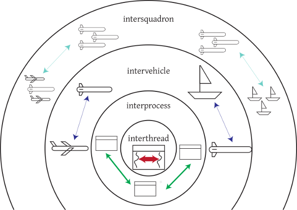
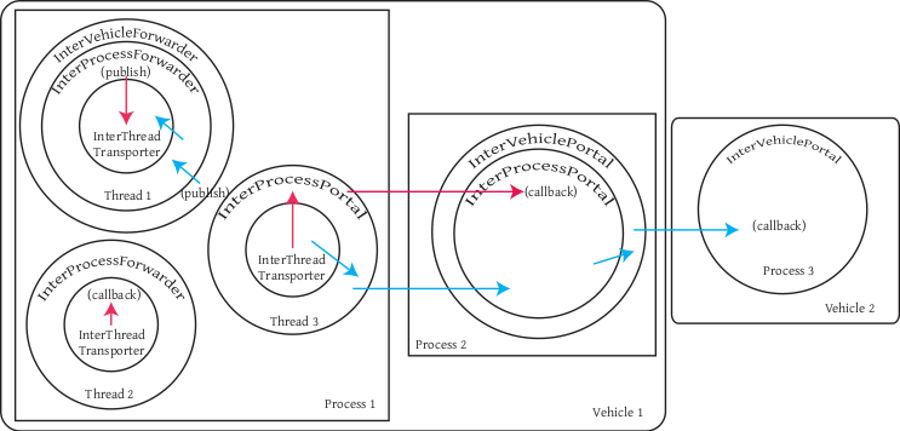

# goby-middleware: Nested middleware overview

The Goby `middleware` is provides a starting point for creating complete marine robotic systems. Superficially, it is similar to MOOS and ROS, but with several key distinguishing differences:

* The Goby middleware is designed around a nested communications model that allows for scalable performance across the huge range of throughput values commonly seen in marine systems (tens of bits per second on an acoustic modem to tens of gigabits per second or more between threads).
* Goby does not dictate a particular marshalling scheme unlike ROS (rosmsg) or MOOS (MOOSMsg) does. You can use any serializable type on the interprocess layer that you choose. Currently we like Google Protocol Buffers, but this is not a necessary choice.
* Goby does not dictate a particular interprocess transport mechanism. We like ZeroMQ which is built on TCP/Unix sockets, but the design of Goby3 allows for additional interprocess implementations to be built as needed or desired.

Please read the [User Manual](http://gobysoft.org/dl/goby3-user-manual.pdf) for more information on the design and motivation of the Goby3 middleware. This page is intended to provide technical detail for developers using and modifying it.

## Nested Transport Layers and Transporters

\image latex ../images/nested_ipc.png "Pictoral representation of the nested layers of the Goby middleware.

Goby3 is designed around the idea of nested communication layers. Three layers are provided in the current implementation (in `goby/middleware/transport`):

* interthread: Thread to thread comms using C++ std::shared_ptr passing.
* interprocess: Process to process comms using some interprocess transport (e.g. [ZeroMQ](doc500_zeromq.md)).
* intervehicle: Vehicle to vehicle comms using [Goby Acomms](doc100_acomms.md).

A Transporter is used to move data around within a layer or between layers using a publish and subscribe model. In most cases, a Transporter comes in a specific flavor: a Portal (used to actually connect to the transport layer, e.g. modem or socket), and a Forwarder (an similar interface that allows indirect multiple access to a given Portal).

See the [Transporter](doc210_transporter.md) page for more details.

### Publishing

The Goby middleware revolves around the widely used publish/subscribe paradigm. One or more publishers produce data (in Goby, a publication is uniquely determined by its marshalling *scheme*, *type*, and *group*) that are consumed by one or more subscribers. Subscribers and publishers are established asynchronously.

Other models like request/reply can be implemented using a degenerate case (single publisher/single subscriber).

When a message is published on a given layer (e.g. intervehicle), it is also automatically recursively published on **all** inner layers (e.g. interprocess and then interthread). This allows a single publication to be used both internally to a layer (e.g. interprocess) and externally. Since each layer is presumed to be more restrictive in throughput than its inner layer, this model adds insignificant overhead.

\image latex ../images/pubsubexample.png "Publication/Subscription example. The blue line shows an intervehicle publication from vehicle1/process1/thread1 to a subscriber on vehicle2. The red line shows an interprocess publication on vehicle1 by process1/thread1 to subscribers on process1/thread2 and process2"

The image above gives an example of the data flow. The blue line shows an intervehicle publication from vehicle1/process1/thread1 to a subscriber on vehicle2. The red line shows an interprocess publication on vehicle1 by process1/thread1 to subscribers on process1/thread2 and process2.

### Subscribing

Subscriptions to a particular layer only apply to that layer. For example, a subscription with an interprocess Transporter will never return data from a different vehicle (only data from processes within that vehicle). Similarly, an interprocess subscription will never return data published on the interthread layer in that process. This means that sometimes it may be necessary to make more than one subscription to the same data scheme, type, group on two or more different layers.