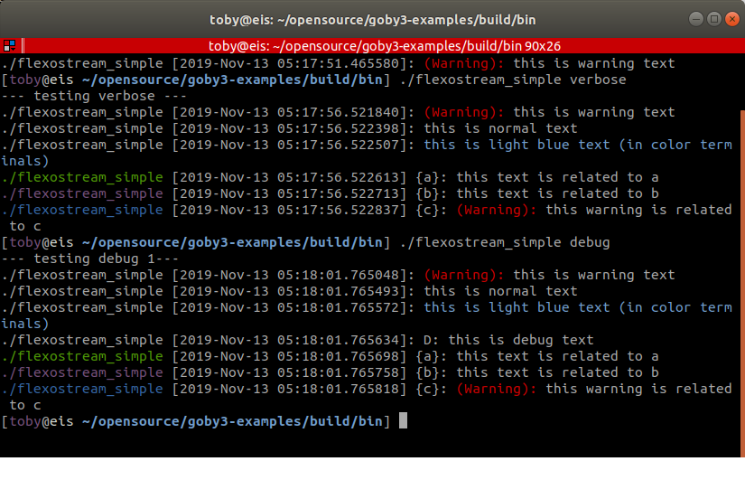
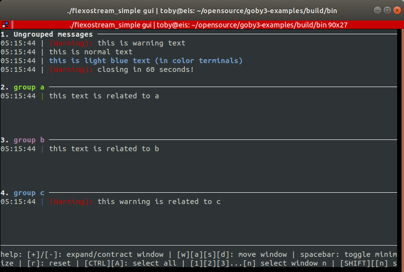

# goby-util: Utility functionality

## Overview

The goby-util libraries are intended to provide functions and classes for handling relevant "utility" tasks, such as logging, string manipulation, scientific calculations, etc. Wherever possible, a high quality open source peer reviewed solution is used (such as the C++ STL, Boost).

## Seawater functions

Since Goby is primarily a marine middleware, a variety of empirical formulas for converting various seawater properties are included:

* goby::util::seawater::depth(): depth from pressure and latitude.
* goby::util::seawater::pressure(): pressure from depth and latitude.
* goby::util::seawater::salinity(): salinity from conductivity, temperature, and pressure.
* goby::util::seawater::density_anomaly(): density anomaly at a given salinity, temperature, and pressure.
* goby::util::seawater::mackenzie_soundspeed(): speed of sound from temperature, salinity, and depth using Mackenzie's formula.

## Constants

Templated constants are provided for `pi`, `e`, and not-a-number ("NaN"). To use, provide the desired precision, e.g.

```
#include <goby/util/constants.h>

// pi
double pi_dbl = goby::util::pi<double>;
float pi_flt = goby::util::pi<float>;

// NaN
double nan_dbl = goby::util::NaN<double>;
double nan_flt = goby::util::NaN<float>;
```

## Geodesy

Goby provides goby::util::UTMGeodesy as a starting point for the most common geodetic conversion (i.e., latitude longitude to Northings and Eastings using UTM on the WGS84 ellipsoid).

goby::util::UTMGeodesy is a thin wrapper around [Proj](https://proj.org/) functions. Proj is a powerful library with many different projections suitable for a variety of different applications.

It is often convenient to work in small X,Y values rather than use the full Northings and Eastings values (which can be quite large given the size of the WGS84 zones). To accomplish this, goby::util::UTMGeodesy takes an origin of convenience (a latitude and longitude) near where the vehicle will be operated. Using this datum, UTMGeodesy can convert between (latitude,longitude) points and (X,Y) points, where X and Y are defined as the distance in Eastings and Northings, respectively from the datum point.

Given \f$e_{datum}\f$ is the UTM eastings value for the datum, and \f$e_{vehicle}\f$ is the UTM eastings value for the vehicle, the X position of the vehicle (\f$x_{vehicle}\f$) is defined as

\f$x_{vehicle} = e_{vehicle} - e_{datum}\f$

The Y value is computed identically from the UTM Northings (\f$n\f$):

\f$y_{vehicle} = n_{vehicle} - n_{datum}\f$

## Automatic identification system (AIS)

The AIS system is used by surface boats and ships to broadcast position and other data via radio. The AIS protocol is based around NMEA-0183 serial messages. The [GPSD page on AIS](https://gpsd.gitlab.io/gpsd/AIVDM.html) has lots of helpful information.

Goby can decode and encode a subset of the AIS serial messages to and from the goby::util::ais::protobuf::Voyage and goby::util::ais::protobuf::Position protocol buffers messages.

Decode (uses [libais](https://github.com/schwehr/libais)) using goby::util::ais::Decoder:

* AIS Messages 1, 2, 3, 18, and 19 to goby::util::ais::protobuf::Position
* AIS Messages 5 and 24 to goby::util::ais::protobuf::Voyage

Encode using goby::util::ais::Encoder:

* goby::util::ais::protobuf::Position to AIS Message 18
* goby::util::ais::protobuf::Voyage to AIS Message 24

## Debug Logging

Because Goby is designed first and foremost as an engineering testbed and scientific research architecture, comprehensive logging is important for debugging both at runtime and post-mission. Thus, Goby provides a logging utility (goby::glog) based on C++ STL streams that provides highly configurable runtime (i.e. terminal window) and/or post-mission (text log file) logging. The syntax inside the code should be familiar to any C++ programmer, as any std::ostream functions can be used.

A simple example:
```
using goby::glog;
glog.is_warn() && glog << "A warning." << std::endl;
glog.is_verbose() && glog << "Useful information for many users" << std::endl;
glog.is_debug1() && glog << "Some debug message" << std::endl;
glog.is_debug2() && glog << "A less commonly needed debug message" << std::endl;
glog.is_debug3() && glog << "A rarely needed debug message" << std::endl;
```

The `is` function both labels a sentence as a particular verbosity level (debug3 is the lowest (typically not shown), die is the highest (always shown)), and also returns a boolean: `true` if this verbosity level is enabled, false otherwise. By virtue of short-circuiting of the `&&` operator, the rest of the stream is not evaluated (and requires no CPU overhead) if the debug output at a particular level is disabled.
 
### Configurable extension of std::ostream

goby::glog extends std::ostream to provide a number of extra logging features. This is generally the preferred logger (instead of std::cout, etc.) for goby applications. Use goby::glog in the same way you would use std::cout or a std::ofstream object. These features include:

*Note:* When using the Goby middleware functionality, you will likely wish to use `goby_logger` in addition to goby::glog to provide a more readily post-processed log file. goby::glog is primarily for human inspection of debug logs (think `/var/log`) whereas `goby_logger` files is more applicable for data processing using MATLAB, Python, etc.

The goby::glog debug logging tool provides:

* efficient logging at different verbosities (where logging at a particular verbosity can be enabled/disabled at runtime). When logging of a particular message is disabled, only a boolean check is required (thus, the stream output itself is not generated).
* simultaneous output to the terminal and configurable output to one or more text files.
* colorized terminal output
* automatic time-date stamping of log entries
* optional thread safe access

The best way to get used to goby::glog is to compile and play with the flexostream_simple.cpp example.

A handful of examples:


\image latex ../images/glogger-example.png "Example of the goby::glog output at different verbosity settings to the terminal window"

Graphical user interface logger mode:


\image latex ../images/glogger-gui.png "Example of the goby::glog in NCurses GUI mode"

Simultaneous terminal window and file logging:

```
flexostream_simple quiet|warn|verbose|debug|gui test.txt
```

Writes the following to test.txt:

```
[ 2019-Nov-13 06:05:40.567321 ]: (Warning): this is warning text
[ 2019-Nov-13 06:05:40.568152 ]: this is normal text
[ 2019-Nov-13 06:05:40.568376 ]: this is light blue text (in color terminals)
[ 2019-Nov-13 06:05:40.568538 ]: D: this is debug text
[ 2019-Nov-13 06:05:40.568701 ]               {a}: this text is related to a
[ 2019-Nov-13 06:05:40.568813 ]               {b}: this text is related to b
[ 2019-Nov-13 06:05:40.568924 ]               {c}: (Warning): this warning is related to c
```

### Thread safe use

The default use of goby::glog is *not* thread safe. To enable thread-safe access (uses a mutex lock/unlock for each call from goby::util::FlexOstream::is to std::endl or std::flush), set (before any concurrent access):

```
goby::glog.set_lock_action(goby::util::logger_lock::lock);
```

When using goby::glog in this mode, it is essential that every call to goby::util::FlexOstream::is (this locks the mutex) be terminated by a std::flush or std::endl (which unlocks the mutex).


## TCP and Serial port communications - linebasedcomms

*Note:* linebasedcomms will be deprecated at some point in favor of the more full-featured subclasses of goby::middleware::io::IOThread (e.g. goby::middleware::io::SerialThreadLineBased). Linebasedcomms will be included in Goby until all the existing modem drivers have been converted.

Linebasedcomms provides a common interface (goby::util::LineBasedInterface) for line-based (defined as blocks of text offset by a common delimiter such as "\\r\\n" or "\\n") text communications over a TCP or serial connection. Linebasedcomms uses the boost::asio library to perform the actual communications.

You should create the proper subclass for your needs:

* Serial communications: goby::util::SerialClient
* TCP Client: goby::util::TCPClient
* TCP Server: goby::util::TCPServer - all incoming messages (as read by goby::util::LineBasedInterface::readline) are interleaved in the order they are received from all connected clients. Outgoing messages are sent to all connected clients unless using goby::util::LineBasedInterface::write (const protobuf::Datagram &msg) and msg.dest() is set to a specific endpoint (ip:port, e.g. "192.168.1.101:5123").
