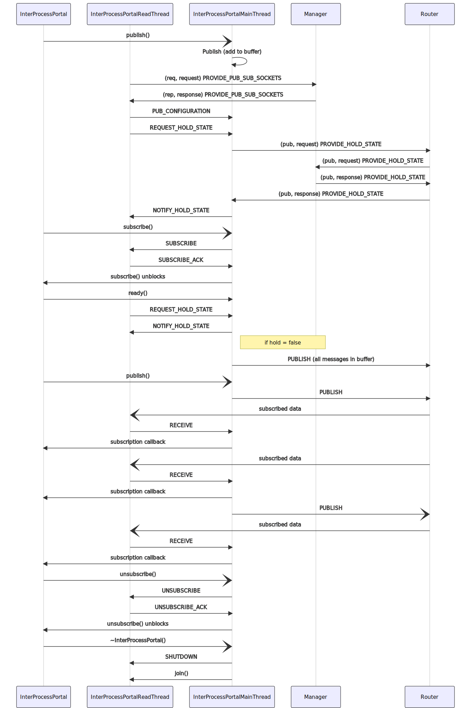

# goby-zeromq: Using ZeroMQ in Goby

ZeroMQ is a lightweight transport layer that extends the UNIX socket concept to more abstract models, one of which is publish/subscribe.

Given its ease of use and portability, it was chosen for the first (reference) implementation of the Goby interprocess Portal.

## Interprocess Portal

The goby::zeromq::InterProcessPortal implements the [Portal concept](doc210_transporter.md) using a broker (typically `gobyd`) containing a zmq::proxy connecting a XPUB frontend and an XSUB backend. The actual zmq::proxy resides in the goby::zeromq::Router class which is run in its own thread. This use of XSUB/XPUB allows multiple publishers of the same data type.

To avoid having to configure two sockets for each client (XPUB and XSUB), these are dynamically allocated by the goby::zeromq::Manager.

The configuration for the Manager is given as a goby::zeromq::protobuf::InterProcessPortalConfig message.

The Manager opens a ZMQ_REP socket on a known address based on the the configuration's `transport` enumeration:

* goby::zeromq::protobuf::InterProcessPortalConfig::IPC, then "ipc://socket_name" where socket_name is "/tmp/goby_{platform}.manager" unless explicity specified in `socket_name`.
* goby::zeromq::protobuf::InterProcessPortalConfig::TCP, then "tcp://*:port" where `port` is also given in the configuration's `tcp_port`.

When a new client (goby::zeromq::InterProcessPortal) connects to the goby::zeromq::Manager, it sends a request using goby::zeromq::protobuf::ManagerRequest, with the request enumeration of goby::zeromq::protobuf::PROVIDE_PUB_SUB_SOCKETS, that is:

```
request: PROVIDE_PUB_SUB_SOCKETS
```

In response, the Manager provides a goby::zeromq::protobuf::ManagerResponse containing the actual sockets required for data (the Router's XPUB/XSUB sockets) in the `subscribe_socket` and `publish_socket` fields. This response may look something like:

```
request: PROVIDE_PUB_SUB_SOCKETS
publish_socket {
 socket_type: PUBLISH
 transport: TCP
 connect_or_bind: CONNECT
 ethernet_address: "127.0.0.1"
 ethernet_port: 36635
 send_queue_size: 1000
 receive_queue_size: 1000
}
subscribe_socket {
  socket_type: SUBSCRIBE
  transport: TCP
  connect_or_bind: CONNECT
  ethernet_address: "127.0.0.1"
  ethernet_port: 35151
  send_queue_size: 1000
  receive_queue_size: 1000
}
```

Once these are received, the application can receive data by subscribing using ZMQ_SUB to the provided `subscribe_socket` and publishing using ZMQ_PUB to the `publish_socket`.

## Wire protocol

The protocol for Goby messages on ZeroMQ consists of an identifier followed by the encoded data. The identifier is variable length but null-terminated, which is what separates it from the data. From ZeroMQ's standpoint this is a single-part message (not a multipart message as you may see referenced in the ZeroMQ documentation).

The identifier is a null-terminated '/' delimited string (analogous to a file path) using the following structure:

```
/group/scheme/type/process/thread/\0
```

These parts are as follows:

* group: The string representation of the goby::middleware::Group
* scheme: The string representation of the scheme if one is defined in goby::middleware::MarshallingScheme::e2s, otherwsie the numeric value as a string (std::to_string)
* type: The type name as returned by goby::middleware::SerializerParserHelper::type_name() for the given message
* process: string representation of the publishing process id (`std::to_string(getpid())`).
* thread: string representation of the publishing thread id based on the hex representation of the std::hash of the id (`goby::middleware::thread_id()`).

Since ZMQ allows wildcard subscription based on substrings, you can subscribe at any point for more messages (don't forget the ending slash or you may get unintended messages if you wanted "Foo" but not "FooBar"):

* "/" subscribes to all messages
* "/group/scheme/" subscribes to all messages of a given group and scheme (from all processes and all threads)
* "/group/scheme/type/" subscribes to all messages of a given group, scheme, and type, but from any process or thread (this is what is typically used by InterProcessPortal).
* "/group/scheme/type/process/" subscribes to a fully qualified message from a particular process pid.

The rest of the message is binary data encoded using the given scheme and type (using goby::middleware::SerializerParserHelper<Data, scheme>::serialize()).

## Applications

The goby::zeromq::SingleThreadApplication and goby::zeromq::MultiThreadApplication provides a good starting point for writing applications using the ZeroMQ Portal implementation. The use of these applications is described in the general [Applications](doc230_application.md) page.

The minimal configuration Protobuf message passed to either of these base classes needs to be:

```
import "goby/middleware/protobuf/app_config.proto";
import "goby/zeromq/protobuf/interprocess_config.proto";

message BasicApplicationConfig
{
    // required parameters for ApplicationBase3 class
    optional goby.middleware.protobuf.AppConfig app = 1;
    // required parameters for connecting to 'gobyd'
    optional goby.zeromq.protobuf.InterProcessPortalConfig interprocess = 2;
}
```

goby::middleware::Application reads the `app` field, and goby::zeromq::InterProcessPortal reads the `interprocess` field. Don't be confused by the use of `optional` here: these fields could be omitted from the instantiated configuration (and defaults will be used), but the fields must always be present in the Protobuf message descriptor (.proto file).

## More detail on InterProcessPortal implementation

The zeromq::InterProcessPortal is composed of two threads:

- InterProcessPortalMainThread: The main thread (same thread that the InterProcessPortal is run in). This handles the ZMQ PUB socket (for outgoing published data). This isn't a new thread, rather a convenience class for separating the InterProcessPortal from its implementation.
- InterProcessPortalReadThread: A second thread spawned by the InterProcessPortalMainThread that handles the ZMQ REQ (for synchronous manager requests), and ZMQ SUB socket (for incoming subscribed data).

This architecture is necessary so that we can properly handle incoming data from ZMQ and then notify the Goby poller's condition variable. 

The two threads communicate through an asynchronous ZMQ INPROC pair (ZMQ_PAIR) of sockets using the goby::zeromq::protobuf::InprocControl message.

`gobyd` contains the `Manager` and `Router` components. The `Router` consists of a ZMQ XSUB/XPUB proxy for multiple publisher to multiple subscriber message passing. The `Manager` provides the clients with the socket configuration (PROVIDE_PUB_SUB_SOCKETS) for publishing and subscribing via the `Router`. In addition, it keeps track of a list of required clients via the "hold" functionality and once all clients have published that they are "ready" (typically this means all necessary subscriptions have been made), the Manager replies to the PROVIDE_HOLD_STATE message with `hold: false`, that is the hold is off and all clients may now begin publishing. This interaction is carried out using publish/subscribe (instead of the REP/REQ socket) since by doing so, the InterProcessPortal ensures that publications can successfully be made, bypassing any connection startup lag that can (and does) exist in connecting the ZMQ sockets.

Note that the InterProcessPortal will buffer publications before the hold is released so that client applications can publish() messages immediately and the messages will be sent once the connection is up (and all required clients, if any, have informed the Manager that they are ready).

The following sequence diagram attempts to show all the interactions between the InterProcessPortal, its underlying threads, and the Manager/Router components:


