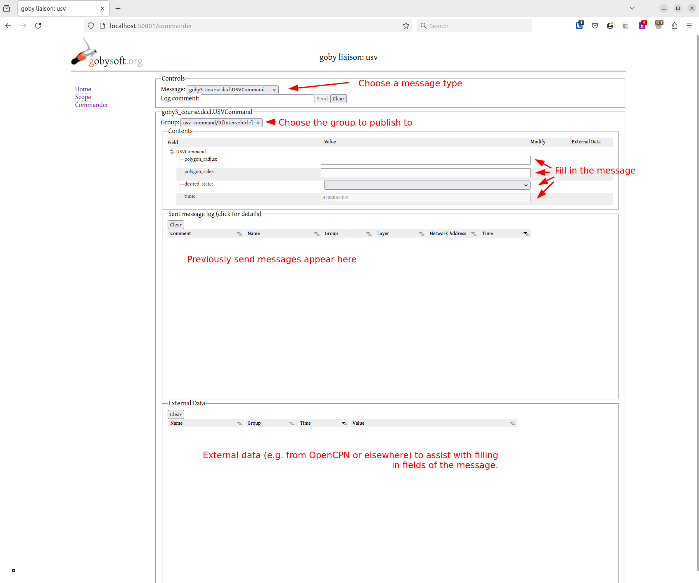
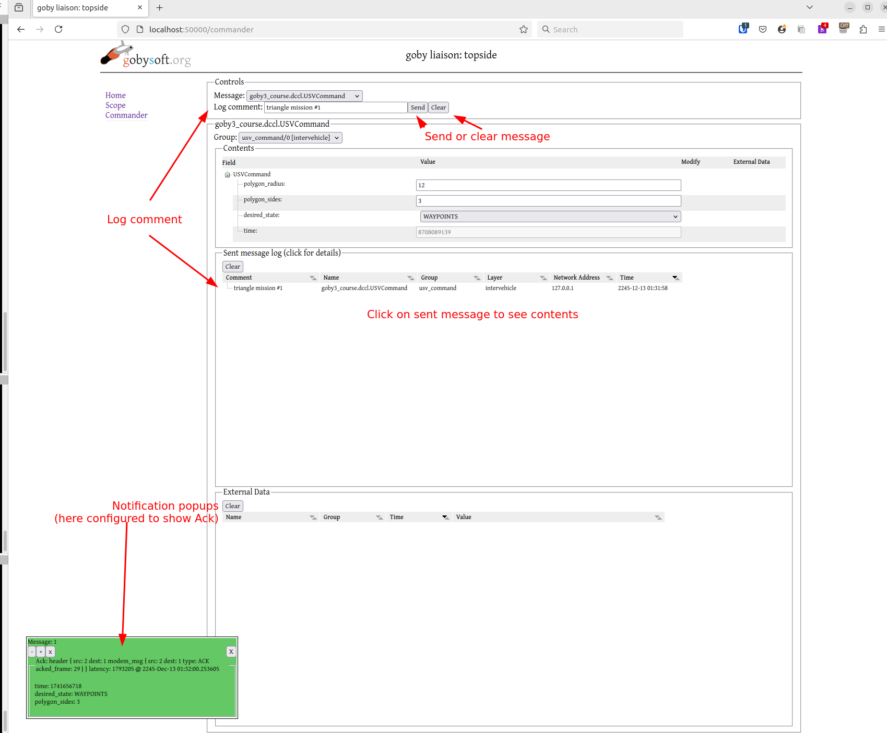
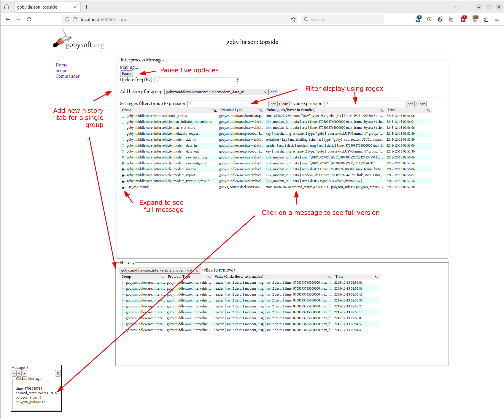

# goby-zeromq: goby_liaison

`goby_liaison` is a C++ web server based on the [Wt toolkit](https://www.webtoolkit.eu/wt). It has several built-in "tabs" and users can write their own tabs and load them using shared libraries (dlopen). Each tab runs in its own thread and can be selected from a menu that runs along the left side of the web page.

The built-in tabs include:

1. Commander: A form for allowing users to publish any Protobuf message on the *intervehicle* or *interprocess* layer. This is typically used for sending commands from an operator to one or more vehicles over the *intervehicle* layer.
2. Scope: A live table showing the latest of all groups containing Protobuf messages  published in the *interprocess* layer, and the ability to show a streaming history of any group. This is a helpful debugging tool, and can be though of as the GUI equivalent of `goby zeromq subscribe`.

## Common Configuration

Several configuration values can be set regardless of the tabs in use:

- `http_address`: IP address or hostname to bind on, e.g., '127.0.0.1' for IPv4 localhost or '0::0' for all addresses.
- `http_port`: Port to bind on, defaults to 54321. Set to `80` for the default HTTP port (but this usually requires root privileges and won't work if any other server such as Apache is running on that port).
- `docroot`: Path to Liaison static objects directory. This can typically be omitted unless you've installed goby_liaison somewhere non-standard.
- `load_shared_library`, `load_proto_file`, `load_proto_dir`: Three ways to specify Protobuf message definitions to load, which is required to decode any messages used by Commander or Scope.
- `add_home_tab`: Defaults to true - set false to omit the Home tab.
- `add_scope_tab`: Defaults to true - set false to omit the Scope tab.
- `add_commander_tab`: Defaults to true - set false to omit the Commander tab.

To access `goby_liaison` from the client side, open a web browser to `http://<http_address>:<http_port>`

## Commander

The following image shows Liaison Commander using the USVCommand protobuf message shown in the [Goby3 Course](https://gobysoft.org/training/goby3-free-course), prior to filling in the message:



After filling in your message and sending it, your window will look something like this:



The relevant configuration to create the Commander UI shown above is:

```
http_address: "0.0.0.0" # bind on all IPv4 sockets
http_port: 50000        # some non-privileged port
# The compiled protobuf messages including "USVCommand" and "CTDControl"
load_shared_library: "/path/to/goby3-course/build/lib/libgoby3_course_messages.so"


pb_commander_config {
    load_protobuf {
        name: "goby3_course.dccl.USVCommand"
        publish_to {
            group: "usv_command"
            group_numeric: 0
            layer: LAYER_INTERVEHICLE
        }
    }
    load_protobuf {
        name: "goby3_course.protobuf.CTDControl"
        publish_to {
            group: "goby3_course::ctd::control"
            layer: LAYER_INTERPROCESS
        }
    }
}
```

The `pb_commander_config` block informs `goby_liaison` of the messages to load and how to publish them after they are filled out and sent by the user:

- pb_commander_config;
	- load_protobuf:
		+ name: Full protobuf name (`package.message`). This Protobuf message must be "known" to `goby_liaison` using `load_shared_library`, `load_proto_file`, or `load_proto_dir`.
		+ publish_to:
			* group: The Goby group to publish to (string name)
			* group_numeric: The numeric group (if any) to publish to (for the `intervehicle` layer). `0` is the "broadcast" group
			* layer: Enumeration for the layer to publish to (LAYER_INTERVEHICLE or LAYER_INTERPROCESS).
		+ external_data: Groups to subscribe to and parse for the "external data" tab
			* name: Protobuf name
			* group: Goby group to subscribe to
			* translate: Map fields from this message to the message in Commander:
				- from: external_data field (fully qualified using '.' separator)
				- to: Commander message field (fully qualified using '.' separator)

When using the LAYER_INTERPROCESS version of `goby_liaison`'s Commander, this is equivalent to a GUI version of the command line tool `goby zeromq publish`.


## Scope 

The `goby_liaison` Scope gives a live view of all the messages in the connected `interprocess` layer:



The default configuration is usually sufficient, but you can customize many of the settings to optimize for your own uses:

- pb_scope_config
	- column_width: Customize initial width of all display columns
		+ group_width: "Group" column width (in pixels).
		+ type_width: "Protobuf Type" column width (in pixels).
		+ value_width: "Value" column width (in pixels).
		+ time_width: "Time" column width (in pixels).
	- sort_by_column: Initial sort column (defaults to COLUMN_GROUP)
	- sort_ascending: Defaults true, set false to sort descending.
	- scope_height: in pixels
	- history_height: in pixels
	- group_regex_filter_expression: Initial regex, defaults to '.*' (show all groups).
	- type_regex_filter_expression: Initial regex, defaults to '.*' (show all types).
	- history: Always show history for one or more groups.
	- max_history_items: Max number of history items show (circular buffer): Defaults to 100.
	- max_message_size_bytes: Messages larger than this size are omitted to reduce CPU load. Defaults to 2048B.


## Writing your own tab

You can create and load your own tab in `goby_liaison` using the Wt toolbox and a shared library plugin (.so).

These open source examples will be helpful to explore while creating your own tab:
1. The Jaiabot post-launch plugin (publish/subscribe): https://github.com/jaiarobotics/jaiabot/tree/1.y/src/lib/liaison/postlaunch
2. The Jaiabot pre-launch plugin (no publish/subscribe, no gobyd): https://github.com/jaiarobotics/jaiabot/tree/1.y/src/lib/liaison/prelaunch
3. The NETSIM plugin (publish/subscribe): https://github.com/GobySoft/netsim/tree/master/src/lib/liaison

Each tab is a subclass of `goby::zeromq::LiaisonContainer` (which is a `Wt::WContainerWidget`), which is defined in:

```
#include <goby/zeromq/liaison/liaison_container.h>
```

If your tab needs to publish/subscribe, you should subclass from `goby::zeromq::LiaisonContainerWithComms` (which is a `goby::zeromq::LiaisonContaine`) and pass your subclass of `goby::zeromq::LiaisonCommsThread` (which is a `goby::middleware::SimpleThread`) as a template parameter.


Your plugin library must define a C function `goby3_liaison_load` that is called by `goby_liaison` to load your tab(s). This function must have the following signature:
```
extern "C"
{
    std::vector<std::unique_ptr<goby::zeromq::LiaisonContainer>>
    goby3_liaison_load(const goby::apps::zeromq::protobuf::LiaisonConfig& cfg);
}
```

The usual parsed configuration file / command line parameters are available in `cfg`. You can extend the `goby::apps::zeromq::protobuf::LiaisonConfig` message (goby/zeromq/protobuf/liaison_config.proto) to allow your application to have specialized configuration. If you wish to use a public extension, create an Issue on Github and we will assign one. For private projects, simply pick any extension values in the range 10000-11000. 

Finally to load your plugin, you need to define the environmental variable `GOBY_LIAISON_PLUGINS` with a comma, semicolon or colon delimited set of path(s) to shared libraries for `goby_liaison` to load. These shared libraries must be fully qualified paths or on the `ld` load path (e.g., using `LD_LIBRARY_PATH`).

A shell script can easily be defined to do all this for you (e.g., name the script `goby_liaison_myproject` so you can just run `goby_liaison_myproject` like you run `goby_liaison` and your tab(s) will always be loaded):

```
#!/bin/bash

LD_LIBRARY_PATH=/path/to/myproject/build/lib:${LD_LIBRARY_PATH} GOBY_LIAISON_PLUGINS=libmyproject_liaison.so exec goby_liaison "$*"
```