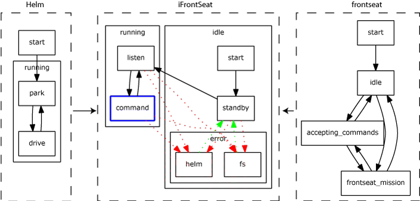

# goby-moos: The Goby/MOOS interoperability library and MOOS Applications

`libgoby_moos` is an optional library that can be compiled when the [MOOS middleware core library](https://github.com/themoos/core-moos) is available. MOOS is a middleware with a long history in marine robotics. This Goby library provides functionality both to improve the use of MOOS, and to allow the Goby middleware to pass data to/from MOOS.

## Goby MOOS Applications 

The Goby MOOS applications share a common subclass of CMOOSApp that provides a validating configuration reader based on the Google Protocol Buffers TextFormat class. The configuration is still embedded within the .moos file, but the syntax is somewhat different. Here you can control logging to a text file and terminal verbosity. You can also initialize a variable in the MOOS database at startup. Many of these parameters will automatically be set to a global MOOS variable (specified outside any ProcessConfig block) if left empty. For example, the global MOOS variable `LatOrigin` will set the Goby MOOS configuration variable `util::lat_origin`. This allows Goby MOOS applications to conform to MOOS *de facto* conventions.

Any Goby MOOS application will give all its valid configuration parameters with 
```
> pGobyApp --example_config
```


Some details about the configuration values:


- `log`: boolean to indicate whether to log terminal output or not to files in the path by `log_path`.
- `log_path`: folder to log all terminal output to for later debugging. Similar to system logs in /var/log.
- `log_verbosity`: verbosity of the log file. See `verbosity` for the various settings.
- `community`: the name of the current vehicle community. If omitted, read from the `Community=` global MOOS configuration field.
- `lat_origin`: a decimal degrees latitude indicating the local cartesian origin. If omitted, read from the `LatOrigin=` global MOOS configuration field.
- `lon_origin`: a decimal degrees longitude indicating the local cartesian origin. If omitted, read from the `LongOrigin=` global MOOS configuration field.
- `app_tick`: same as AppTick.
- `comm_tick`: same as CommsTick.
- `verbosity`: choose `DEBUG1`-`DEBUG3` for various levels of debugging output, `VERBOSE` for some text terminal output, `WARN` for warnings only, and `QUIET` for no terminal output.
- `show_gui`: if true, the running terminal opens an NCurses GUI helpful to debugging and visualizing the many data flows of pAcommsHandler. The verbosity in this GUI is governed by `verbosity`.
- `initializer`: since many times it is useful to have a MOOS variable including in a message that remains static for a given mission (vehicle name, etc), we give the option to publish initial MOOS variables here (for later use in messages [until overwritten, of course]). If `global_cfg_var` is set, pAcommsHandler looks for a global (i.e. specified at the top of the MOOS file or outside any `ProcessConfig` blocks) value in the .moos file with the name to the right of the colon and publishes it to a MOOS variable with the name to the left of the colon. For example: `initializer { global_cfg_var: "LatOrigin" moos_var: "LAT_ORIGIN" }` looks for a variable in the .moos file called `LatOrigin` and publishes it to the MOOSDB as a double variable `LAT_ORIGIN` with the value given by `LatOrigin`.

## pTranslator
 

`pTranslator` is a translator between MOOS types (strings and doubles) and Google Protocol Buffers messages (which includes DCCL messages). All of the functionality of `pTranslator` is also present in `pAcommsHandler`, but `pTranslator` is provided as a standalone application for cases when Goby-Acomms is not needed, but the translation functionality is. Also, pTranslator loops back all created messages and immediately publishes them, whereas pAcommsHandler publishes messages received acoustically, and creates messages to be transmitted.

The configuration for `pTranslator` (also see `pTranslator --example_config`) is as follows:

- `common`: Parameters that can be set for any of the Goby MOOS applications.
- `load_shared_library`: Repeated string, each with a path to a shared library containing compiled DCCL (Google Protocol Buffers) messages.
- `load_proto_file`: Repeated string, each with one path to a .proto file containing compiled DCCL (Google Protocol Buffers) messages. These will be compiled at runtime and loaded. It is preferable to use `load_shared_library` when possible, as syntactical and type mistakes in the DCCL messages will be caught at compile-time rather than delayed to runtime.
- `translator_entry`: Repeated entry: there should be one `translator_entry` defined for each Google Protobuf message type that you wish to translate to or from.
	- `protobuf_name`: Fully qualified name (packages separated by `.`, e.g. `example.MinimalStatus`) to the Protobuf message that this translator should use. This message must be loaded either by `load_shared_library` or `load_proto_file`. 
	- `trigger`: The event that causes this translation to occur.
		- `type`: Either `TRIGGER_PUBLISH` (do a translation every time a given MOOS variable is published to) or `TRIGGER_TIME` (do a translation on a regular frequency).
		- `moos_var`: For `TRIGGER_PUBLISH`, the MOOS variable that causes the translation to occur.
		- `period`: For `TRIGGER_TIME`, the period (in seconds) between translations.
		- `mandatory_content`: For `TRIGGER_PUBLISH`, if this is defined, the `moos_var` must contain this substring in order to trigger this translation. Use of this field allows a single MOOS variable to trigger several different translations.
	- `create`: Upon triggering, this defines how the Protobuf message is created from one or more MOOS variables. Repeat this field for multiple MOOS variables. The `create` directives are processed in the order they are defined and thus later `create`s that write the same fields will overwrite earlier ones.
		- `technique`: The parsing technique to use. See the **Translator techniques** section.
		- `moos_var`: The MOOS variable to use for this `create`. 
		- `format`: For `TECHNIQUE_FORMAT`, the format string to use. This is similar to scanf, but instead of type specifiers, numerical specifiers are used, surrounded by `%` on both sides. For example, if the format value is `foo=%1%`, this create will parse a moos_var containing `foo=5` and put the value 5 into field 1 of the Protobuf message given by `protobuf_name`.
		- `repeated_delimiter`: When parsing for repeated Protobuf fields, this is the string that delimits fields. For example, if `foo=%1%`, field 1 is `repeated int32 field_name = 1`, and the value to parse is `foo=10;12;13;14`, repeated_delimiter should be `";"` in order to parse these four numbers into a "vector" of values in that field.
		- `algorithm`: An algorithm to modify the parsed field before placing it in the Protobuf message. These are largely provided for backwards compatibility for Goby v1, and are not necessarily encouraged for new use. See  for a detailing of the available algorithms. Several algorithms can be chained (processed in the order they are defined) by repeated this `algorithm` field with the same `primary_field`.
			- `name`: Name of the algorithm, e.g. `to_upper`.
			- `primary_field`: The field number to apply this algorithm to. 
	- `publish`: Upon receipt of a Protobuf message, how to publish it back to one or more MOOS variable(s). Several `publish` entries should be specified to publish to several MOOS variables.
		- `technique`: The serialization technique to use. See section .
		- `moos_var`: The MOOS variable to write to for this `publish`. 
		- `format`: For `TECHNIQUE_FORMAT`, the format string to use. This is similar to printf, but instead of type specifiers, numerical specifiers are used, surrounded by `%`.
		- `repeated_delimiter`: When writing `repeated` Protobuf fields, this is the string that is used to delimit fields. 
		- `algorithm`: Several algorithms can be chained (processed in the order they are defined) by repeated this `algorithm` field with the same `primary_field`.
			- `name`: Name of the algorithm, e.g. `to_upper`.
			- `primary_field`: The field number to apply this algorithm to. 
			- `output_virtual_field`: A ``virtual'' field number (one that doesn't exist in the actual Protobuf message) that is used to specify the output of this algorithm. This virtual field can then be used in the `format` string like a real field. 
			- `reference_field`: The field(s) required by the algorithm as references, if the algorithm requires them (e.g. `utm_x2lon`).
	- `use_short_enum`: If true, the front of the enumeration value is removed if it matches the field name plus a `_`. For example, if the enum field is `foo`, and the enumerations are `FOO_OPTION1`, `FOO_OPTION2`, then `OPTION1` and `OPTION2` are published. If false (the default), the enumeration values are published as defined. This is mostly here for backwards compatibility with Goby 1.


### Translator techniques
 

There are three broad categories of translator techniques: 1) those that use the Google Protocol Buffers tools (`TECHNIQUE_PREFIXED_PROTOBUF_TEXT_FORMAT`, `TECHNIQUE_PROTOBUF_TEXT_FORMAT`,`TECHNIQUE_PROTOBUF_NATIVE_ENCODED`), 2) one that uses the *de facto* MOOS convention of `key=value` pairs delimited by commas (`TECHNIQUE_COMMA_SEPARATED_KEY_EQUALS_VALUE_PAIRS`), and 3) one that is based roughly on printf/scanf (`TECHNIQUE_FORMAT`).

More details on each translator type:

- `TECHNIQUE_PROTOBUF_TEXT_FORMAT`: exactly the same as if you used the [Google TextFormat class](https://protobuf.dev/reference/cpp/api-docs/google.protobuf.text_format/).
- `TECHNIQUE_PREFIXED_PROTOBUF_TEXT_FORMAT` (recommended for most uses). Same as `TECHNIQUE_PROTOBUF_TEXT_FORMAT` but prefixed with `@PB[TypeName]`, so that you can put multiple Protobuf Types in a single MOOS Variable (if you really need to). It's also quite human readable and allows for programs to read / write generic Protobuf messages. This technique is useful enough, there are two shortcut functions for use in your C++ MOOS code: `#include <goby/moos/moos_protobuf_helpers.h>`: `serialize_for_moos` and `parse_for_moos`.
- `TECHNIQUE_PROTOBUF_NATIVE_ENCODED`: exactly the same as if you used the default binary Google encoding (binary), represented as a byte string. This tends to break the MOOS tools that assume strings are ASCII / UTF-8. 
- `TECHNIQUE_COMMA_SEPARATED_KEY_EQUALS_VALUE_PAIRS`: all fields represented as `key1=value1,key2=value2,...` Messages with submessages are flattened and the keys assembled by concatenation separated with `_`. This is similar to the existing `NODE_REPORT` variable used in MOOS-IvP.
- `TECHNIQUE_FORMAT`: sort of like printf / scanf, except instead of typed directives (e.g. `%d`), Goby uses numeric directives that correspond the protobuf message field id (e.g. `foobar=%2%`). Submessages can be referenced using ":" (e.g. `%5:1%`, where field 5 is a Message), repeated fields can be referenced using "." (e.g. `%7.1%`, where field 7 is repeated). Note the ending `%` on each directive, which is different than printf. This is implemented using [Boost Format](https://www.boost.org/doc/libs/release/libs/format/doc/format.html).


## pAcommsHandler
 

pAcommsHandler provides a:

- MOOS Application wrapper for the Goby-Acomms communication library.
- set of translation tools for converting the DCCL messages (written as an extension of Google Protocol Buffers) to MOOS types (strings and doubles) and vice-versa.
- full backwards-compatibility support module for version 1 XML messages. 


This section describes only the parts relevant for interface to MOOS (variables and translator entries that allow you to read and write to and from DCCL (Protobuf) messages). You should read Chapter  before starting this section and reference it as necessary.

### Parameters for the pAcommsHandler Configuration Block

#### Example moos file

pAcommsHandler has a large number of configuration options, many of which you will never use or leave as default. You can always get a complete listing of MOOS file parameters with their syntax by running

> pAcommsHandler --example_config

#### Filling out the .moos file

Many of the parameters are sufficiently explained in the above list of configuration parameters. What follows is a detailed explanation of the parameters that need further explanation.

- `common`: Parameters that can be set for any of the Goby MOOS applications.
- `modem_id`: integer that specifies the `modem_id` of this current vehicle / community. For the WHOI Micro-Modem this is the Micro-Modem "SRC" configuration parameter (as set by `$CCCFG,SRC,#`). For the remainder of the document, `modem_id` refers to the value `$CCCFG,SRC,modem_id`. This configuration parameter will be set on startup. Setting this within the main block for pAcommsHandler sets it for all the modules (`driver_cfg`, `queue_cfg`, `mac_cfg`) 
- `driver_type`: 
	- `DRIVER_WHOI_MICROMODEM` is a driver for the WHOI Micro-Modem. 
	- `DRIVER_ABC_EXAMPLE_MODEM` is a simple test "modem". Do not use this for real work, but rather for learning how to write new drivers for Goby.
	- `DRIVER_UFIELD_SIM_DRIVER` is a driver for the MOOS-IvP uField toolbox.
	- `DRIVER_STORE_SERVER` is a driver for the `goby_store_server` database.
	- `DRIVER_UDP` is a user datagram protocol (UDP) driver. This is probably the easiest driver to start with for learning pAcommsHandler.
	- `DRIVER_NONE` disables the modem driver.
- `driver_cfg`: Configures the base driver and the specific driver selected.
- `mac_cfg`: Configures the acoustic Medium Access Control.
- `queue_cfg`: Configures the Priority Queuing layer.
- `dccl_cfg`: Configures the Dynamic Compact Control Language.
- `route_cfg`: Configures a basic static routing module. This is experimental and subject to change.
- `moos_var`: Rename any or all of the MOOS variables published by pAcommsHandler.
- `load_shared_library`: Repeated string, each with a path to a shared library containing compiled DCCL (Google Protocol Buffers) messages.
- `load_proto_file`: Repeated string, each with one path to a .proto file containing compiled DCCL (Google Protocol Buffers) messages. These will be compiled at runtime and loaded. It is preferable to use `load_shared_library` when possible, as syntactical and type mistakes in the DCCL messages will be caught at compile-time rather than delayed to runtime.
- `translator_entry`: List of entries indicating when to make (*trigger*) and how to *create* outgoing DCCL messages, and how to *publish* incoming DCCL messages. This can be thought of as providing a generic interface between MOOS strings and Google Protocol Buffers messages. See section  for a full explanation on how to configure this translation.
- `multiplex_create_moos_var`: Used by `goby_liaison` to publish multiple commands (outgoing messages) on a single MOOS variable.
- `modem_id_lookup_path`: path to a text file giving the mapping between `modem_id` and vehicle name and type for a given experiment. This file should look like:
```
// modem id, vehicle name (should be community name), vehicle type
0, broadcast, broadcast
1, endeavor, ship
3, unicorn, auv
4, macrura, auv
```
- `transitional_cfg`: Provides the same functionality as `dccl_cfg` does in pAcommsHandler from version 1 of Goby. Behind the scenes, XML messages are read, translated to version 2 Protobuf DCCL messages, and written to the `generated_proto_dir`, and subsequently loaded using `load_proto_file`. The appropriate `translator_entry`s are also created from these messages. Do not use this configuration or the XML representation of DCCL messages for any new projects. See the version 1 documentation () for more details on the XML representation of DCCL messages.


## iFrontSeat

iFrontSeat is a MOOS application used to interface a Goby/MOOS community (the "backseat") running pHelmIvP with a given manufacturer's vehicle (the "frontseat").

### Motivation

Broadly, our goal in Goby is facilitate the development of a autonomy, sensing, and communications infrastructure that can operate on a heterogeneous collection of
vehicles. One way to help effect this is to split the system into two components: the frontseat and backseat computing systems. The frontseat is provided by the vehicle manufacturer and is typically proprietary. It is responsible for low level
control of the vehicle. The backseat runs the high level autonomy (typically the IvP Helm), sensing, and communications (typically Goby) components. The requirements of the frontseat on the backseat is minimally a continuous (e.g. 1 Hz) stream of course directives, such as desired heading, speed, and depth of the AUV. The requirements of the backseat on the frontseat is a best attempt to carry out these directives constrained by the dynamics of the vehicle, as well as a feed of the
vehicles’ navigation solution.

Not surprisingly, a piece of software is required to interface between the frontseat
and the backseat. This code (iFrontSeat) is the subject of section. 

Historically, a new interface has been written for each vehicle that was to be used with MOOS-IvP. This led to a proliferation of approaches for handling the state transitions and control, primarily from pHelmIvP. In some cases, misunderstandings involving various aspects of MOOS-IvP led to vehicle runaways. Furthermore, as MOOS-IvP becomes even more widely adopted and the number of manufacturers of robotic assets increases, it seems sensible to minimize the duplication of effort involved in writing interfaces.

### Design overview 

iFrontSeat (and its corresponding components in the library libgoby_moos) is comprised of two major components:
- A base class FrontSeatInterfaceBase and MOOS Application iFrontSeat providing the IvP Helm state transition logic and MOOSDB subscriptions and publications. This is written once and used by all the specific drivers.
- A collection of derived classes (which are compiled into individual shared libraries) to implement the interface provided by FrontSeatInterfaceBase for a given manufacturer or vehicle type.

### Running iFrontSeat
 
iFrontSeat always requires exactly one driver library to be loaded before any command-line parameters will be accepted. The driver libraries are runtime-loaded because this allows for a driver developer to create his or her own driver without changing any of the Goby source code. The driver library is loaded from the environmental variable `IFRONTSEAT_DRIVER_LIBRARY`. For example, use the
bash shell, one can load iFrontSeat with the Bluefin driver with
this invocation: 

```
IFRONTSEAT_DRIVER_LIBRARY=libgoby_frontseat_bluefin.so.30 iFrontSeat
```

The library specified must be a complete path or on the ld library search path (e.g. set using `LD_LIBRARY_PATH`). Alternatively, you could export `IFRONTSEAT_DRIVER_LIBRARY` from one of the shell configuration files (e.g. ~/.bashrc), and then simply run iFrontSeat on the command line.

### Shared MOOS Side Components

iFrontSeat is a Goby MOOS application, which means it uses a validating configuration reader based on Google Protocol Buffers instead of the standard MOOS ProcessConfigReader. The syntax is similar, and you can always get all the valid configuration parameters by running

```
iFrontSeat --example_config
```

Many of these parameters can be left to their defaults, except for special cases and advanced usages.

The configuration for iFrontSeat has three main parts:

1. The common configuration which is the same for all Goby MOOS applications. Please see the **Goby MOOS Applications** section for details. Setting `verbosity: DEBUG2` is useful for debugging (and also `show_gui: true`, which displays an NCurses screen with useful debugging information).
2. The configuration for the shared MOOS side components, described below in this section.
3. The vehicle driver specific configuration.

The configuration for the shared MOOS components is:
- require_helm: Require the IvP Helm even for a listening mission where the frontseat is in control (default=true).
- helm_running_timeout: If require_helm: true, how long (in seconds) to wait for the IvP Helm to start before moving to the Helm Error state. (default=10)
- frontseat_connected_timeout: How long (in seconds) to wait for the Frontseat to be connected before moving to the Frontseat Error state. (default=10)
- status_period: Seconds between publishing the status of iFrontseat. The special value 0 disables posting of the status message (default=5).
- moos_var: Change the default values of the MOOS variables published or subscribed to by iFrontSeat. Throughout the manual, these defaults are referenced. If you change the values here, keep this in mind when reading the rest of the manual.
	- prefix: Prefix all MOOS variable names with this string (default="IFS_")
	- raw_out: variable used to post raw (e.g. NMEA-0183) messages from iFrontSeat to the vehicle frontseat. (default="RAW_OUT")
	- raw_in: variable used to post raw messages from the vehicle frontseat to iFrontSeat. (default="RAW_IN")
	- command_request: variable used for commands that iFrontSeat should request the vehicle frontseat to carry out.
(default="COMMAND_REQUEST")
	- command_response: if supported by the frontseat driver, the variable used to post the result (success or failure with error information) of a given request. (default="COMMAND_RESPONSE")
	- data_from_frontseat: the variable used to post any navigation and/or
sensor data from the frontseat. (default="DATA_IN")
	- data_to_frontseat: the variable used to post any data to be sent to the frontseat. (default="DATA_OUT")
	- status: the variable used to post the state of the frontseat,  vP helm,
and iFrontSeat. (default="STATUS")
- exit_on_error: If true, exit the application if it enters one of the error states.
Use only for debugging. (default=false)
- legacy_cfg: Numerous options to automatically convert legacy variables (e.g., from iHuxley) into the iFrontSeat messages. Generally new projects will not use any of these options and thus this configuration block can be omitted. 

### MOOS Variable Interface

The preferred way to use iFrontSeat is via the new IFS_ set of variables. The contents of these string MOOS variables are the output of the TECHNIQUE_PREFIXED_PROTOBUF_TEXT_FORMAT translator.

Essentially, they are the TextFormat human-readable output of the Google Protocol Buffers messages defined in
`goby/middleware/protobuf/frontseat.proto`.

To get access to the C++ equivalent classes generated by the Protobuf C++ compiler (protoc), include this header:
```
#include "goby/middleware/protobuf/frontseat.pb.h"
```

Do not parse these messages manually. You can automatically parse and serialize these values to and from the corresponding Protobuf C++ classes using the functions `serialize_for_moos` and `parse_for_moos`, which are declared in the header
file:
```
#include "goby/moos/moos_protobuf_helpers.h"
```
The MOOS variables subscribed to by iFrontSeat include (note the names are configurable, the defaults are given here):

- `IFS_COMMAND_REQUEST`: Command from to give to the frontseat driver to be asked of the vehicle’s computer. This is typically the desired course (heading, speed, and depth) of the vehicle. Other special commands may be defined by the specific vehicle driver. Protobuf Message type: `goby.middleware.frontseat.protobuf.CommandRequest`.
- `IFS_DATA_TO_FRONTSEAT`: Data that must be passed to the frontseat driver. For example, the Bluefin AUVs require Conductivity-Temperature-Depth (CTD) measurements when the CTD is connected to the backseat computer. Protobuf Message type: `goby.middleware.frontseat.protobuf.InterfaceData`.

The MOOS variables published by iFrontSeat include:

- `IFS_COMMAND_RESPONSE`: Response to each command request, if a response is requested. Protobuf Message type: `goby.middleware.frontseat.protobuf.CommandResponse`.
- `IFS_STATUS`: The current state of the IvP Helm, the frontseat system, and the interface itself. Protobuf Message type:
goby.middleware.frontseat.protobuf.InterfaceStatus. 
- `IFS_DATA_FROM_FRONTSEAT`: Data from the frontseat driver. This may include navigation data (vehicle’s current pose, speed, depth, latitude, longitude, etc), or other vehicle specific data. Protobuf Message type: `goby.middleware.frontseat.protobuf.InterfaceData`.
- `IFS_RAW_IN`: Raw communications packets (e.g. NMEA-0183) from the frontseat computer to iFrontSeat. Protobuf Message type:
`goby.middleware.frontseat.protobuf.Raw`
- `IFS_RAW_OUT`: Raw communications packets (e.g. NMEA-0183) from iFrontSeat to the frontseat computer. Protobuf Message type: `goby.middleware.frontseat.protobuf.Raw`

### Writing a new driver for iFrontSeat

The existing drivers are mentioned in the [goby_frontseat_interface](doc506_goby_frontseat_interface.md) page.

#### Overview

iFrontSeat is intended to interface to a wide range of vehicles using any interface (e.g. proprietary extensions of NMEA-0183). The purpose of the driver is to implement the Goby FrontSeatInterfaceBase in the language of the particular frontseat vehicle system. Minimally, these are the requirements of the frontseat:

* it can provide a navigation solution for the vehicle (minimally latitude, longitude, depth, and speed), and typically also the geo-referenced pose of the vehicle (heading, pitch, yaw).
* it can accept a desired heading, speed, and depth (at around 1 Hz) for the vehicle and carry out these commands as quickly as reasonably possible given the vehicle's dynamics.

Additionally, the frontseat may provide or consume:

* arbitrary sensor data (e.g. CTD samples, acoustic modem datagrams)
* additional special commands (e.g. buoyancy adjustment, activate/deactivate sensors, low power mode) that the backseat can command of the frontseat.

#### State charts

The state of iFrontSeat (as shown in the following diagram) is determined by a combination of the state of the frontseat and the state of pHelmIvP. Only the state of the frontseat must be determined by each new driver, as the state of pHelmIvP is determined by code shared by all the drivers.



The **state of the frontseat** consists of two parallel state charts (command and data):

* Command state
    * FRONTSEAT_IDLE (required): The frontseat computer is alive and well, but is not running any mission (the vehicle is a standby mode).
    * FRONTSEAT_ACCEPTING_COMMANDS (required): The frontseat is accepting the backseat commands.
    * FRONTSEAT_NOT_CONNECTED (optional): No communication with the frontseat computer has been established (or a connection has been lost). If there is no way to tell whether the frontseat is alive at any given time, this state may not be implemented.
    * FRONTSEAT_IN_CONTROL (optional): The frontseat is running a mission and driving the vehicle but not accepting commands from the backseat. If the frontseat never runs missions without backseat control, this state may not be implemented.
* Data state (not diagrammed above)
    * frontseat_providing_data == true: The frontseat is providing all required data. What is required is determined by the specific driver, but at a minimum is the navigation solution.
    * frontseat_providing_data == false: The frontseat is not providing all required data.

The state transitions for the iFrontSeat interface states are (using the names as defined in the enumerations in moos/protobuf/frontseat.proto)

| From | To | Action |
|------|----|--------|
| Start | INTERFACE_STANDBY | Configuration Read |
| INTERFACE_STANDBY | INTERFACE_LISTEN | frontseat_providing_data == true |
| INTERFACE_LISTEN | INTERFACE_COMMAND | FRONTSEAT_ACCEPTING_COMMANDS && HELM_DRIVE |
| INTERFACE_COMMAND | INTERFACE_LISTEN | (FRONTSEAT_IN_CONTROL \|\| FRONTSEAT_IDLE) && HELM_DRIVE |
| INTERFACE_COMMAND | INTERFACE_HELM_ERROR | HELM_NOT_RUNNING \|\| HELM_PARK |
| INTERFACE_LISTEN \|\| INTERFACE_COMMAND | INTERFACE_HELM_ERROR | HELM_PARK \|\| if (helm_enabled) HELM_NOT_RUNNING (after timeout) |
| INTERFACE_LISTEN \|\| INTERFACE_COMMAND | INTERFACE_FS_ERROR | FRONTSEAT_NOT_CONNECTED \|\| frontseat_providing_data == false |
| INTERFACE_STANDBY | INTERFACE_FS_ERROR | FRONTSEAT_NOT_CONNECTED (after timeout) |
| INTERFACE_HELM_ERROR | INTERFACE_STANDBY | HELM_DRIVE |
| INTERFACE_FRONTSEAT_ERROR | INTERFACE_STANDBY | (if(ERROR_FRONTSEAT_NOT_CONNECTED) !FRONTSEAT_NOT_CONNECTED) \|\| (if(ERROR_FRONTSEAT_NOT_PROVIDING_DATA) frontseat_providing_data == true) |

#### Example "ABC" driver

We will show you how to a write a new driver by example. To do so, we have created a simple frontseat simulator ("abc_frontseat_simulator") that is intended to represent the real vehicle frontseat control system. The full source code for this example is given at:

* components/moos/abc_frontseat_driver/abc_frontseat_driver.h
* components/moos/abc_frontseat_driver/abc_frontseat_driver.cpp
* components/moos/abc_frontseat_driver/abc_frontseat_driver_config.proto

A complete production driver is provided by BluefinFrontSeat for the Bluefin Robotics AUVs that conform to the Bluefin Standard Payload Interface version 1.8 and newer.

The transport for the ABC frontseat is TCP: the simulator (frontseat) listens on a given port and the driver connects to that machine and port. The wire protocol is a simple ascii line-based protocol where lines are terminated by carriage-return and newline (`<CR><NL>` or "\r\n"). Each message has a name (key), followed by a number of comma-delimited, colon-separated fields:

| Key | Description | Direction (relative to frontseat) | Format | Example |
|-----|-------------|----------------------------------|--------|---------|
| START | Simulator initialization message | Receive | `START,LAT:{latitude decimal degrees},LON:{longitude decimal degrees},DURATION:{simulation duration seconds}` | `START,LAT:42.1234,LON:-72,DURATION:600` |
| CTRL | Frontseat state message | Transmit | `CTRL,STATE:{PAYLOAD (if backseat control) or IDLE}` | `CTRL,STATE:PAYLOAD` |
| NAV | Navigation message generated from very primitive dynamics model (depth & heading changes are instantaneous) | Transmit | `NAV,LAT:{latitude decimal degrees},LON:{longitude decimal degrees},DEPTH:{depth in meters},HEADING:{heading in degrees},SPEED:{speed in m/s}` | `NAV,LAT:42.1234,LON:-72.5435,DEPTH:200,HEADING:223,SPEED:1.4` |
| CMD | Desired course command from backseat | Receive | `CMD,HEADING:{desired heading in degrees},SPEED:{desired speed in m/s},DEPTH:{desired depth in m}` | `CMD,HEADING:260,SPEED:1.5,DEPTH:100` |
| CMD | Response to last CMD | Transmit | `CMD,RESULT:{OK or ERROR}` | `CMD,RESULT:OK` |

At a minimum, your driver will include a C linkage function `frontseat_driver_load` and a subclass of `goby::moos::FrontSeatInterfaceBase`. It should be compiled into a shared library (.so on Linux).

The C function is used by iFrontSeat to load your driver:

```
extern "C"
{
    goby::moos::FrontSeatInterfaceBase* frontseat_driver_load(goby::apps::moos::protobuf::iFrontSeatConfig* cfg)
    {
        return new AbcFrontSeat(*cfg);
    }
}
```

First you should decide what configuration your driver will accept. Your configuration object is an extension to the Google Protobuf message "iFrontSeatConfig". For the ABC frontseat driver, we use the `abc_frontseat_driver_config.proto` file to define the configuration (see `src/moos/frontseat/abc/abc_frontseat_driver_config.proto`).

In this case, we need to know what IP address and TCP port the abc_frontseat_simulator is listening on, and the starting position of the simulator.

Next, you should fill out the virtual methods of goby::moos::FrontSeatInterfaceBase:

* The method "frontseat_state" reports the driver's belief of the frontseat command state.

```
goby::moos::protobuf::FrontSeatState AbcFrontSeat::frontseat_state() const
{
    return frontseat_state_;
}
```

In this case, we set the value of frontseat_status_ based on the received "CTRL" messages:

```
    if (parsed["KEY"] == "CTRL")
    {
        if (parsed["STATE"] == "PAYLOAD")
            frontseat_state_ = gpb::FRONTSEAT_ACCEPTING_COMMANDS;
        else if (parsed["STATE"] == "AUV")
            frontseat_state_ = gpb::FRONTSEAT_IN_CONTROL;
        else
            frontseat_state_ = gpb::FRONTSEAT_IDLE;
    }
```

* The method "frontseat_providing_data" reports the frontseat's data state (see the **State charts** section above). It must return true if the frontseat is providing data to the driver reasonably often (where reasonable is defined by the driver). Here we set the class member variable "frontseat_providing_data_" to true each time we get a "NAV" message, and then false if we have had no "NAV" messages in the last 10 seconds.

```
bool AbcFrontSeat::frontseat_providing_data() const
{
    return frontseat_providing_data_;
}
```

* The method "send_command_to_frontseat" is called whenever iFrontSeat needs to send a command to the frontseat. This command typically contains a desired heading, speed, and depth, but could alternatively contain a special command defined via an extension to the goby::moos::protobuf::CommandRequest message.

```
void AbcFrontSeat::send_command_to_frontseat(const gpb::CommandRequest& command)
{
    if (command.has_desired_course())
    {
        std::stringstream cmd_ss;
        const goby::moos::protobuf::DesiredCourse& desired_course = command.desired_course();
        cmd_ss << "CMD,"
               << "HEADING:" << desired_course.heading() << ","
               << "SPEED:" << desired_course.speed() << ","
               << "DEPTH:" << desired_course.depth();
        write(cmd_ss.str());
        last_request_ = command;
    }
    else
    {
        glog.is(VERBOSE) && glog << "Unhandled command: " << command.ShortDebugString()
                                 << std::endl;
    }
}
```

* The method "send_data_to_frontseat" is called whenever iFrontSeat needs to send data to the frontseat. These data could include sensor readings from instruments that are directly connected to the backseat, such as a CTD or acoustic modem. Our bare-bones example frontseat doesn't require any data from the backseat, so we just leave an empty implementation here.

```
void AbcFrontSeat::send_data_to_frontseat(const gpb::FrontSeatInterfaceData& data)
{
    // ABC driver doesn't have any data to sent to the frontseat
}
```

* The method "send_raw_to_frontseat" is called whenever an external application wants to directly control the frontseat. This can be left blank (or post a warning to the glog) if there is no need (or desire) to allow for direct control of the frontseat from external applications.
* The method "loop" is called regularly (at the AppTick of iFrontSeat) and is where you can read data from the frontseat and do other regular work.

```
void AbcFrontSeat::loop()
{
    check_connection_state();
    try_receive();
    // if we haven't gotten data for a while, set this boolean so that the
    // FrontSeatInterfaceBase class knows
    if (goby_time<double>() > last_frontseat_data_time_ + allowed_skew)
        frontseat_providing_data_ = false;
}
```

Now, the final task is to call the appropriate signals in FrontSeatInterfaceBase upon receipt of data and responses to commands. The signals are called just like normal functions with the corresponding signatures. These signals (except signal_raw_to_frontseat) are typically called in response to data received in the loop() method.

* signal_data_from_frontseat: Call when a navigation solution is received from the frontseat. This may have to be merged from several messages, which is why goby::moos::protobuf::NodeStatus has the *_time_lag fields. These fields can be used to indicate the offset of certain fields from the timestamp on the message. You can use the FrontSeatInterfaceBase::compute_missing to compute the loocal fix (X, Y, Z) from the global fix (latitude, longitude, depth) or vice-versa.
* signal_command_response: Call when the frontseat acknowledges a command, if the command request includes response_requested == true. Include the success or failure of the command, and an error code (with description) if applicable. 
* signal_raw_from_frontseat: Call when a raw message (e.g. "CMD,RESULT:OK") is received from the frontseat. This is for logging and debug purposes.
* signal_raw_to_frontseat: Call when a raw message (e.g. "CMD,HEADING:260,SPEED:1.5,DEPTH:100") is send to the frontseat. This is for logging and debug purposes.

For testing the ABC driver to see how it functions, you will need to run 

```
abc_frontseat_simulator 54321
```
where 54321 is the port for the simulator to listen on. 

Then, run iFrontSeat in a MOOS community with pHelmIvP with the following configuration:

```
ProcessConfig = iFrontSeat_bluefin
{
    common { 
        verbosity: DEBUG1
    }
    [abc_config] {  #  (optional)
      tcp_address: "localhost"  #  (required)
      tcp_port: 54321  #  (optional) (default=54321)
      start { lat: 44.0888889 lon: 9.84861111 duration: 600 }
    }
}
```

You can change the start position as desired.

