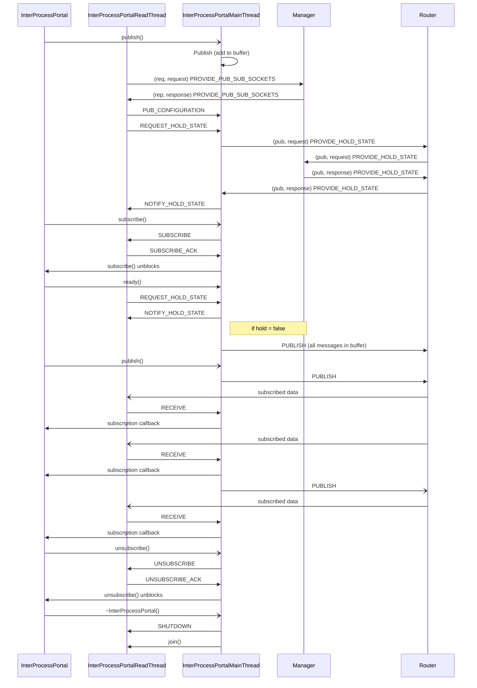

```mermaid
sequenceDiagram
    participant portal as InterProcessPortal
    participant read as InterProcessPortalReadThread
    participant main as InterProcessPortalMainThread
    participant manager as Manager
    participant router as Router
    
    portal-)main: publish()
    main->>main: Publish (add to buffer)
    read->>manager: (req, request) PROVIDE_PUB_SUB_SOCKETS
    manager->>read: (rep, response) PROVIDE_PUB_SUB_SOCKETS
    read->>main: PUB_CONFIGURATION    
    read->>main: REQUEST_HOLD_STATE
    main->>router: (pub, request) PROVIDE_HOLD_STATE
    router->>manager: (pub, request) PROVIDE_HOLD_STATE
    manager->>router: (pub, response) PROVIDE_HOLD_STATE
    router->>main: (pub, response) PROVIDE_HOLD_STATE
    main->>read: NOTIFY_HOLD_STATE
    portal-)main: subscribe()
    main->>read: SUBSCRIBE
    read->>main: SUBSCRIBE_ACK
    main->>portal: subscribe() unblocks
    portal->>main: ready()
    read->>main: REQUEST_HOLD_STATE
    main->>read: NOTIFY_HOLD_STATE
    Note right of main: if hold = false
    main->>router: PUBLISH (all messages in buffer)
    portal-)main: publish()
    main->>router: PUBLISH
    router-)read: subscribed data
    read->>main: RECEIVE
    main->>portal: subscription callback
    router-)read: subscribed data
    read->>main: RECEIVE
    main->>portal: subscription callback
    main-)router: PUBLISH
    router-)read: subscribed data
    read->>main: RECEIVE
    main->>portal: subscription callback
    portal-)main: unsubscribe()
    main->>read: UNSUBSCRIBE
    read->>main: UNSUBSCRIBE_ACK
    main->>portal: unsubscribe() unblocks
    portal-)main: ~InterProcessPortal()
    main->>read: SHUTDOWN
    main->>read: join()
```
