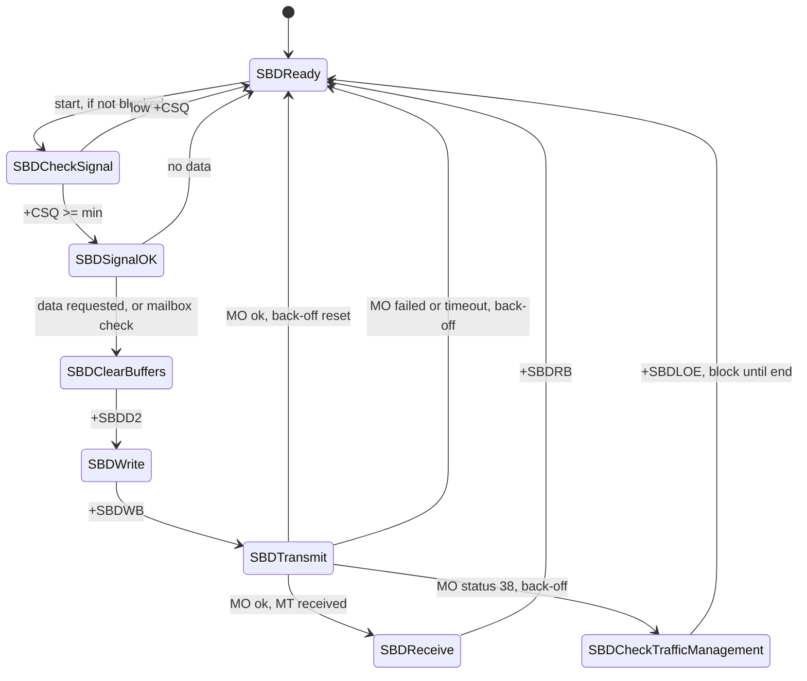

```mermaid
stateDiagram-v2
    direction TB
    [*] --> SBDReady
    SBDReady --> SBDCheckSignal: start, if not blocked
    SBDCheckSignal --> SBDReady: low +CSQ
    SBDCheckSignal --> SBDSignalOK: +CSQ >= min
    SBDSignalOK --> SBDClearBuffers: data requested, or mailbox check
    SBDSignalOK --> SBDReady: no data
    SBDClearBuffers --> SBDWrite: +SBDD2
    SBDWrite --> SBDTransmit: +SBDWB
    SBDTransmit --> SBDReceive: MO ok, MT received
    SBDTransmit --> SBDReady: MO ok, back-off reset
    SBDTransmit --> SBDReady: MO failed or timeout, back-off
    SBDTransmit --> SBDCheckTrafficManagement: MO status 38, back-off
    SBDCheckTrafficManagement --> SBDReady: +SBDLOE, block until end
    SBDReceive --> SBDReady: +SBDRB
```
